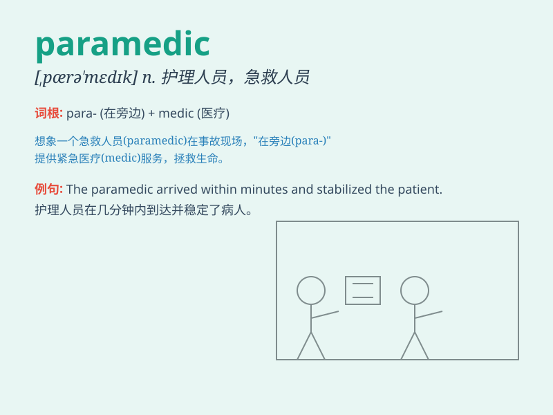

## paramedic

**英音:** _[,pærə\'medɪk]_ **美音:** _[,pærə\'mɛdɪk]_

**译义:** *n.伞兵军医,护理人员*

### 短语

+ **paramedic team:** _急救医疗小组_

+ **paramedic training:** _急救医疗培训_

+ **experienced paramedic:** _经验丰富的急救员_

+ **paramedic service:** _急救医疗服务_

+ **emergency paramedic:** _紧急急救员_

### 例句

#### 例句1

> **The paramedic quickly assessed the patient\'s condition.**

**中文翻译:** 这位急救医疗人员迅速评估了病人的状况。

**单词释义:** 急救医疗人员

#### 例句2

> **The paramedic provided first aid to the injured athlete.**

**中文翻译:** 这位急救员为受伤的运动员提供了急救。

**单词释义:** 急救员

#### 例句3

> **We called a paramedic when my father had a heart attack.**

**中文翻译:** 当我父亲心脏病发作时，我们叫了一位急救医疗人员。

**单词释义:** 急救医疗人员

### 背诵小故事

> 想象一下，在一场重大事故现场，有一位勇敢的 paramedic
冲在前面。他快速地评估伤者情况，熟练地处理伤口，给予急救。他就像战场上的英雄，挽救着生命。

**想象在重大事故现场，一位勇敢的护理人员冲在前面，快速评估伤者情况、处理伤口和给予急救，像战场上的英雄挽救生命。**

### 图义

