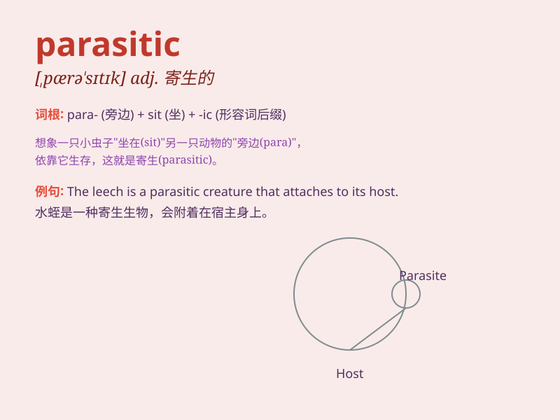

## parasitic

**英音:** _[pærə\'sɪtɪk]_ **美音:** _[,pærə\'sɪtɪk]_

**译义:** * 寄生的*

### 短语

+ **parasitic infection:** _寄生虫感染_

+ **parasitic plant:** _寄生植物_

+ **parasitic worm:** _寄生虫_

+ **parasitic relationship:** _寄生关系_

+ **parasitic disease:** _寄生虫病_

### 例句

#### 例句1

> **Some plants have parasitic relationships with other
organisms.**

**中文翻译:** 一些植物与其他生物有寄生关系。

**单词释义:** 寄生的

#### 例句2

> **The doctor diagnosed the patient with a parasitic infection.**

**中文翻译:** 医生诊断这位患者有寄生虫感染。

**单词释义:** 寄生虫的；由寄生虫引起的

#### 例句3

> **Parasitic weeds can harm the growth of crops.**

**中文翻译:** 寄生杂草会损害农作物的生长。

**单词释义:** 寄生的

### 背诵小故事

> A poor ant was constantly bothered by a tiny bug. This bug was
parasitic, always relying on the ant for food and shelter. The ant
struggled to get rid of it. Finally, with great effort, the ant was free
from the parasitic bug.

**一只可怜的蚂蚁一直被一只小虫子困扰。这只虫子是寄生的，总是依靠蚂蚁获取食物和住所。蚂蚁努力摆脱它。最终，经过巨大努力，蚂蚁摆脱了这只寄生虫。**

### 图义

