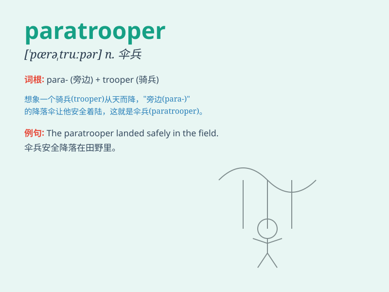

## paratrooper

**英音:** _[\'pærətruːpə]_ **美音:** _[\'pærətrupɚ]_

**译义:** *n.伞兵*

### 短语

+ **elite paratrooper:** _精英伞兵_

+ **experienced paratrooper:** _经验丰富的伞兵_

+ **trained paratrooper:** _训练有素的伞兵_

+ **combat paratrooper:** _作战伞兵_

+ **skillful paratrooper:** _技术娴熟的伞兵_

### 例句

#### 例句1

> **The paratrooper landed safely in the enemy territory.**

**中文翻译:** 这名伞兵在敌占区安全着陆。

**单词释义:** 伞兵

#### 例句2

> **A group of paratroopers were sent on a special mission.**

**中文翻译:** 一组伞兵被派去执行一项特殊任务。

**单词释义:** 伞兵

#### 例句3

> **The paratrooper showed great courage during the battle.**

**中文翻译:** 这名伞兵在战斗中表现出了极大的勇气。

**单词释义:** 伞兵

### 背诵小故事

>
想象一下，在战争中，有一群勇敢的士兵从飞机上跳伞。他们就像勇敢的飞鸟，迅速降落到地面执行任务。这些勇敢跳伞的士兵就是
paratrooper。

**想象在战争中，一群勇敢的伞兵从飞机跳伞执行任务的情景来辅助记忆
paratrooper 这个单词，意思是伞兵。**

### 图义

