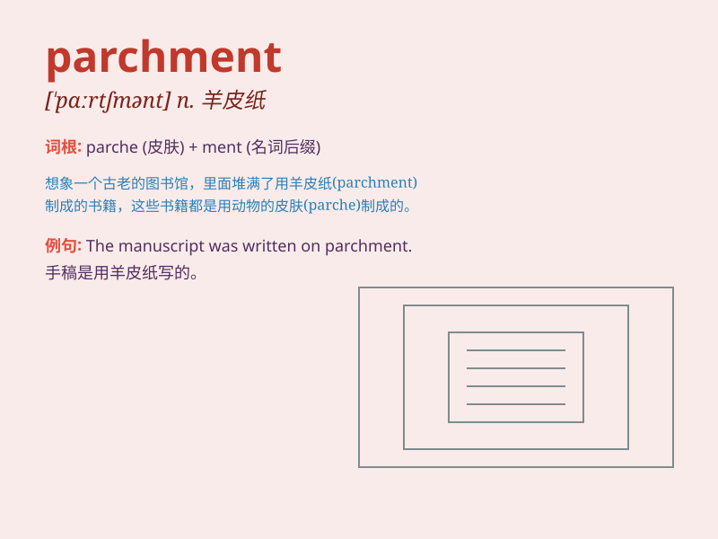

## parchment

**英音:** _[\'pɑːtʃm(ə)nt]_ **美音:** _[\'pɑrtʃmənt]_

**译义:** *n.羊皮纸,毕业文凭*

### 短语

+ **parchment paper:** _羊皮纸；油纸_

+ **parchment scroll:** _羊皮纸卷轴_

+ **ancient parchment:** _古老的羊皮纸_

+ **fine parchment:** _优质羊皮纸_

+ **parchment manuscript:** _羊皮纸手稿_

### 例句

#### 例句1

> **The ancient manuscript was written on parchment.**

**中文翻译:** 这份古老的手稿是写在羊皮纸上的。

**单词释义:** 羊皮纸

#### 例句2

> **She carefully rolled up the parchment and tied it with a
ribbon.**

**中文翻译:** 她小心地把羊皮纸卷起来，并用丝带系好。

**单词释义:** 羊皮纸

#### 例句3

> **The artist used parchment for her detailed drawing.**

**中文翻译:** 这位艺术家使用羊皮纸来进行她的精细绘画。

**单词释义:** 羊皮纸

### 背诵小故事

> A long time ago, a wise scribe used a special material called
parchment to write important secrets. The parchment was smooth and
durable, making it perfect for preserving knowledge. Remember, parchment
is that special writing material!

**很久以前，一位睿智的抄写员使用一种叫做羊皮纸的特殊材料来书写重要的秘密。羊皮纸光滑且耐用，非常适合保存知识。记住，parchment
就是那种特殊的书写材料！**

### 图义

