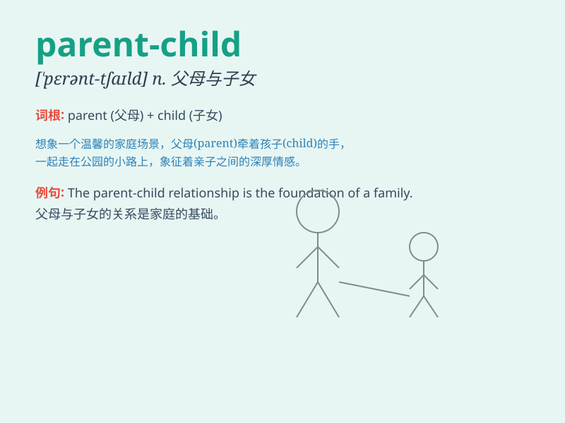

## parent-child

**英音:** _[ˈpɛərənt tʃaɪld]_ **美音:** _[ˈpɛrənt
tʃaɪld]_

**译义:** *n. 父母与子女关系；亲子关系*

### 短语

+ **parent-child relationship:** _亲子关系_

+ **parent-child interaction:** _亲子互动_

+ **parent-child communication:** _亲子沟通_

+ **parent-child bond:** _亲子纽带_

+ **parent-child conflict:** _亲子冲突_

### 例句

#### 例句1

> **The parent-child relationship is very important for a child\'s
growth.**

**中文翻译:** 亲子关系对于孩子的成长非常重要。

**单词释义:** 指父母与子女之间的关系

#### 例句2

> **There is a strong bond in the parent-child connection.**

**中文翻译:** 在亲子联系中存在着强大的纽带。

**单词释义:** 描述父母与子女之间的关联

#### 例句3

> **Parent-child communication often helps solve problems.**

**中文翻译:** 亲子间的交流常常有助于解决问题。

**单词释义:** 强调父母和子女之间的交流

### 背诵小故事

> One day, a parent and a child went for a picnic. The parent cared for
the child, sharing food and playing. This shows the special bond between
a parent and a child.

**有一天，一位家长和一个孩子去野餐。家长照顾孩子，分享食物并一起玩耍。这展现了家长与孩子之间特殊的联系。**

### 图义

