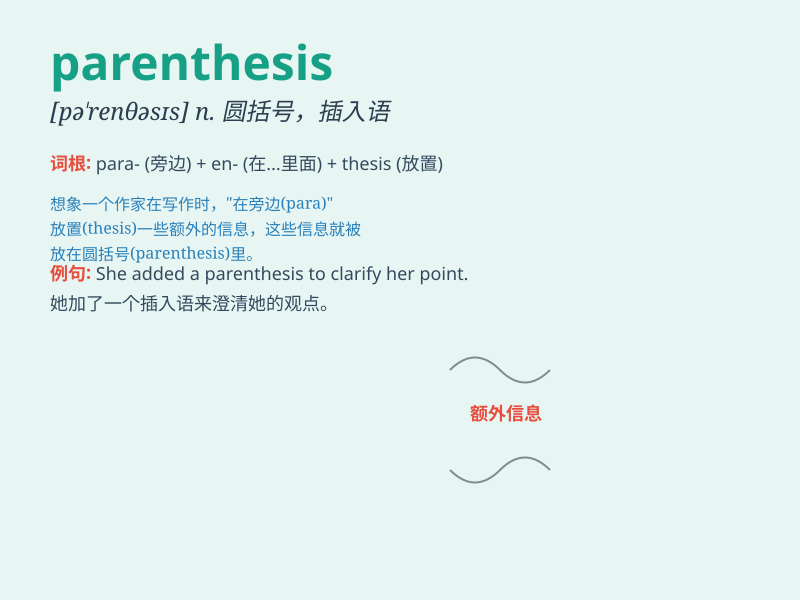

## parenthesis

**英音:** _[pə\'renθɪsɪs]_ **美音:** _[pə\'rɛnθəsɪs]_

**译义:** *n.插入语,附带,插曲,圆括号*

### 短语

+ **in parenthesis:** _作为插入语；在括号内_

+ **round parenthesis:** _圆括号_

+ **parenthesis mark:** _括号符号_

+ **open parenthesis:** _左括号；开括号_

+ **close parenthesis:** _右括号；闭括号_

### 例句

#### 例句1

> **Use parentheses to clarify the meaning of the sentence.**

**中文翻译:** 使用括号来阐明这个句子的意思。

**单词释义:** 括号

#### 例句2

> **The information in parentheses is not essential to the main
point.**

**中文翻译:** 括号里的信息对于要点来说不是必需的。

**单词释义:** 括号

#### 例句3

> **She added a note in parentheses at the end of the paragraph.**

**中文翻译:** 她在段落的末尾用括号添加了一个注释。

**单词释义:** 括号

### 背诵小故事

> A little mouse was running around in a maze. Suddenly, it found a
hidden door with many parenthesis-shaped patterns. It wondered what
secrets were behind those (curved lines).

**一只小老鼠在迷宫里跑来跑去。突然，它发现了一扇隐藏的门，上面有许多括号形状的图案。它好奇那些（弯曲的线条）后面藏着什么秘密。**

### 图义

