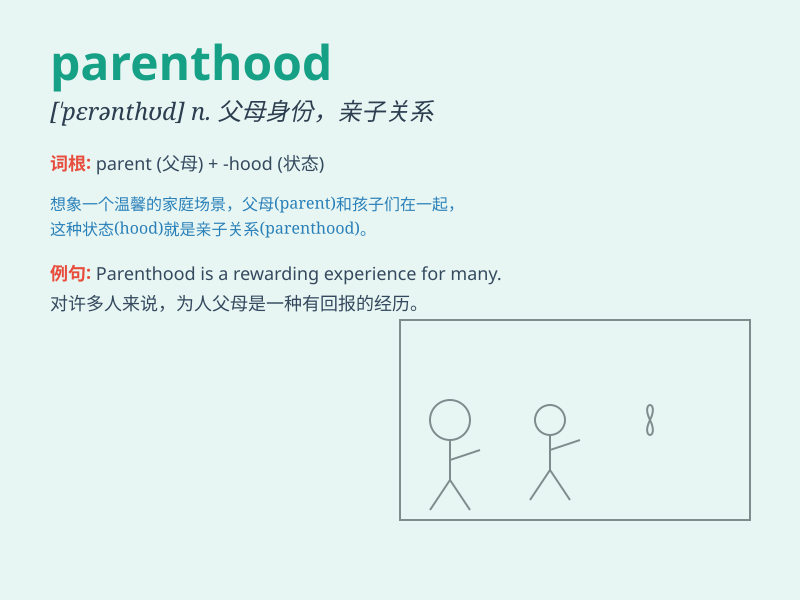

## parenthood

**英音:** _[\'peər(ə)nthʊd]_ **美音:** _[\'pɛrənthʊd]_

**译义:** *n.父母身份,亲子关系*

### 短语

+ **enter parenthood:** _为人父母_

+ **assume parenthood:** _承担父母的责任_

+ **responsibilities of parenthood:** _为人父母的责任_

+ **joys of parenthood:** _为人父母的快乐_

+ **the challenges of parenthood:** _为人父母的挑战_

### 例句

#### 例句1

> **Parenthood is a challenging but rewarding journey.**

**中文翻译:** 为人父母是一段充满挑战但有回报的旅程。

**单词释义:** 为人父母的状态

#### 例句2

> **She embraced parenthood with enthusiasm and love.**

**中文翻译:** 她满怀热情和爱地迎接为人父母的角色。

**单词释义:** 为人父母

#### 例句3

> **The responsibilities of parenthood can be overwhelming at
times.**

**中文翻译:** 为人父母的责任有时会让人不堪重负。

**单词释义:** 为人父母

### 背诵小故事

> A young couple was excited about parenthood. They imagined taking
their child to the park, teaching them to ride a bike, and watching them
grow. With these dreams, they understood the meaning and responsibility
of parenthood.

**一对年轻夫妇对为人父母感到兴奋。他们想象着带孩子去公园，教孩子骑自行车，看着孩子成长。带着这些梦想，他们理解了为人父母的意义和责任。**

### 图义

