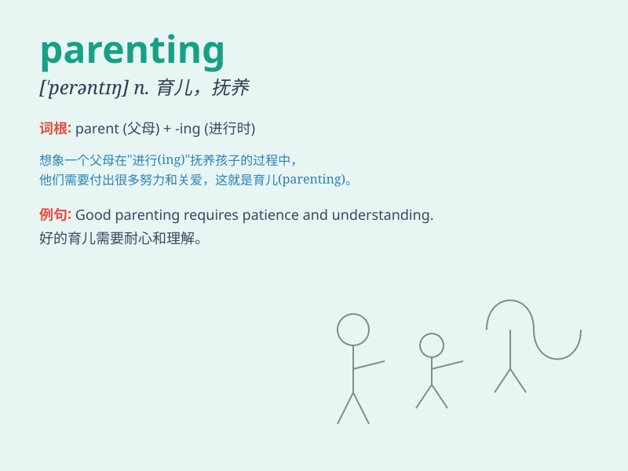

## parenting

**英音:** _[ˈpeərəntɪŋ]_ **美音:** _[ˈperəntɪŋ]_

**译义:** *n.养育；教养；育儿*

### 短语

+ **good parenting:** _良好的养育方式_

+ **effective parenting:** _有效的育儿方法_

+ **parenting skills:** _育儿技能_

+ **parenting style:** _育儿风格_

+ **modern parenting:** _现代育儿方式_

### 例句

#### 例句1

> **Good parenting skills are essential for raising happy and healthy
children.**

**中文翻译:** 良好的育儿技巧对于养育快乐和健康的孩子至关重要。

**单词释义:** 养育子女；为人父母的做法

#### 例句2

> **She is passionate about parenting and often shares her
experiences with others.**

**中文翻译:** 她对育儿充满热情，并且经常与他人分享她的经验。

**单词释义:** 养育；教养子女

#### 例句3

> **Parenting can be both rewarding and challenging.**

**中文翻译:** 养育子女既可能有回报也可能充满挑战。

**单词释义:** 父母对子女的养育

### 背诵小故事

> A young couple was struggling with parenting. One day, they saw an
old man teaching his grandchildren patiently. Inspired, they learned
that parenting is about love, patience and guidance. Now they are great
parents.

**一对年轻夫妇在育儿方面很吃力。有一天，他们看到一位老人耐心地教导孙子孙女。受到启发，他们明白了育儿就是爱、耐心和引导。现在他们是很棒的父母。**

### 图义

