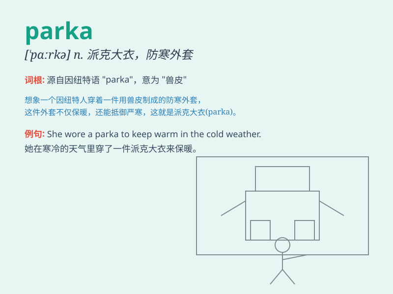

## parka

**英音:** _[\'pɑːkə]_ **美音:** _[\'pɑrkə]_

**译义:** *n.皮制大衣*

### 短语

+ **fur parka:** _毛皮风雪大衣_

+ **hooded parka:** _带兜帽的风雪大衣_

+ **down parka:** _羽绒风雪大衣_

+ **winter parka:** _冬季风雪大衣_

+ **camouflage parka:** _迷彩风雪大衣_

### 例句

#### 例句1

> **She wore a warm parka to protect herself from the cold wind.**

**中文翻译:** 她穿着一件暖和的派克大衣来抵御寒风。

**单词释义:** 派克大衣

#### 例句2

> **The parka has a fur-lined hood for extra warmth.**

**中文翻译:** 这件派克大衣有一个毛皮衬里的风帽以增加保暖性。

**单词释义:** 派克大衣

#### 例句3

> **He zipped up his parka before going skiing.**

**中文翻译:** 他在去滑雪前拉上了派克大衣的拉链。

**单词释义:** 派克大衣

### 背诵小故事

> One cold winter day, Tom was shivering outside. His friend gave him a
parka. It was thick and warm, protecting him from the freezing wind. Tom
was so grateful and never forgot the comfort of that parka.

**在一个寒冷的冬日，汤姆在外面冻得发抖。他的朋友给了他一件派克大衣。它又厚又暖和，保护他免受寒风侵袭。汤姆非常感激，永远忘不了那件派克大衣带来的温暖。**

### 图义

