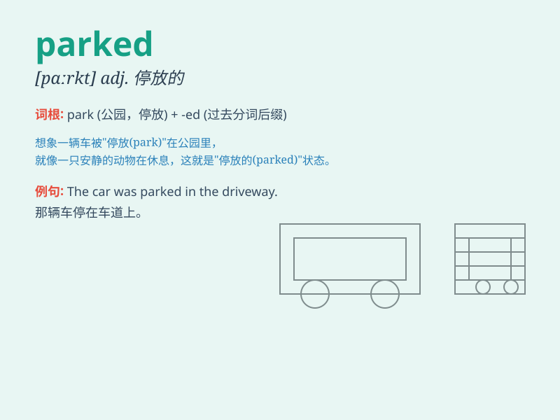

## parked

**英音:** _[pɑːkt]_ **美音:** _[pɑːrkt]_

**译义:** *v.停放（车辆）（park的过去式和过去分词）*

### 短语

+ **parked car:** _停放的汽车_

+ **parked illegally:** _非法停车_

+ **parked vehicle:** _停放的车辆_

+ **parked neatly:** _整齐停放_

+ **parked outside:** _停在外面_

### 例句

#### 例句1

> **The car was parked illegally on the sidewalk.**

**中文翻译:** 这辆车非法停在人行道上。

**单词释义:** 停放（过去式）

#### 例句2

> **He parked his bike in front of the store.**

**中文翻译:** 他把自行车停在了商店前面。

**单词释义:** 停放（过去式）

#### 例句3

> **The plane was parked at the airport terminal.**

**中文翻译:** 飞机停在机场航站楼。

**单词释义:** 停放（过去式）

### 背诵小故事

> One day, I was walking in the city. I saw a car parked neatly beside
the road. The owner had gone shopping. It was a red car and looked very
shiny. I thought it was so beautiful.

**有一天，我在城市里散步。我看到一辆车整齐地停在路边。车主去购物了。这是一辆红色的车，看起来非常闪亮。我觉得它太漂亮了。**

### 图义

