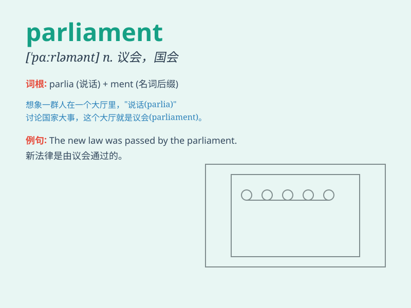

## parliament

**英音:** _[\'pɑːləm(ə)nt]_ **美音:** _[\'pɑrləmənt]_

**译义:** *n.国会,议会*

### 短语

+ **Parliament Building:** _议会大厦_

+ **Parliament Session:** _议会会议_

+ **Members of Parliament:** _议会议员_

+ **Parliamentary Committee:** _议会委员会_

+ **Parliamentary Election:** _议会选举_

### 例句

#### 例句1

> **The parliament passed a new law to protect the environment.**

**中文翻译:** 议会通过了一项保护环境的新法律。

**单词释义:** 议会

#### 例句2

> **He was elected to the parliament last year.**

**中文翻译:** 他去年被选入议会。

**单词释义:** 议会

#### 例句3

> **The issue was debated in the parliament for several days.**

**中文翻译:** 这个问题在议会中被辩论了好几天。

**单词释义:** 议会

### 背诵小故事

>
想象一下，一群智者在一个大大的房间里热烈讨论国家大事。这个房间就叫\'parliament\'，他们在为民众的利益出谋划策，制定规则。

**想象一群智者在叫'议会'的房间里讨论国家大事，辅助记忆'parliament（议会；国会）'这个单词**

### 图义

