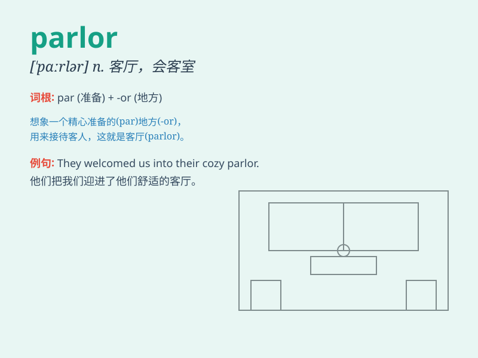

## parlor

**英音:** _[ˈpɑːlə]_ **美音:** _[ˈpɑrlər]_

**译义:** *n.客厅,会客室,店营业室,业务室adj.客厅的*

### 短语

+ **beauty parlor:** _美容院_

+ **ice cream parlor:** _冰淇淋店_

+ **funeral parlor:** _殡仪馆_

+ **massage parlor:** _按摩院_

+ **tattoo parlor:** _纹身店_

### 例句

#### 例句1

> **She went to the beauty parlor to get a manicure.**

**中文翻译:** 她去美容院做美甲。

**单词释义:** 美容院

#### 例句2

> **The ice cream parlor is always crowded on weekends.**

**中文翻译:** 这家冰淇淋店周末总是很拥挤。

**单词释义:** 店铺；店

#### 例句3

> **They were sitting in the parlor chatting.**

**中文翻译:** 他们正坐在客厅聊天。

**单词释义:** 客厅；起居室

### 背诵小故事

> A young girl entered the parlor, which was filled with beautiful
furniture. She saw a big sofa and a table with flowers. The parlor was
so cozy that she wanted to stay there forever.

**一个年轻女孩走进客厅，里面摆满了漂亮的家具。她看到一张大沙发和一张摆着鲜花的桌子。这个客厅非常舒适，以至于她想永远待在那里。**

### 图义

