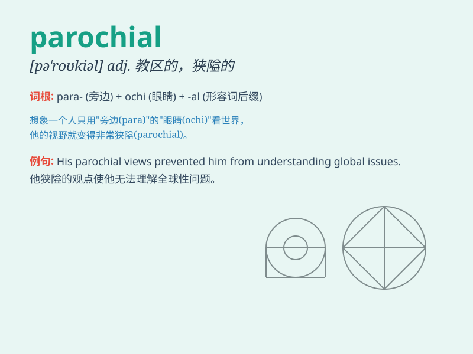

## parochial

**英音:** _[pə\'rəʊkɪəl]_ **美音:** _[pə\'rokɪəl]_

**译义:** *adj.教区的,地方范围的,狭小的*

### 短语

+ **parochial school:** _教会学校；教区学校_

+ **parochial attitude:** _狭隘的态度_

+ **parochial interests:** _狭隘的兴趣_

+ **parochial mentality:** _狭隘的心理_

+ **parochial outlook:** _狭隘的观点_

### 例句

#### 例句1

> **The parochial school provided a strict education.**

**中文翻译:** 这所教区学校提供严格的教育。

**单词释义:** 教区的

#### 例句2

> **His views are rather parochial and limited.**

**中文翻译:** 他的观点相当狭隘和有限。

**单词释义:** 狭隘的；目光短浅的

#### 例句3

> **The parochial attitude of the villagers prevented them from
accepting new ideas.**

**中文翻译:** 村民们狭隘的态度使他们无法接受新观念。

**单词释义:** 狭隘的；地方观念的

### 背诵小故事

> A small-town boy always thought his village was the best. He had a
parochial view and refused to explore outside. One day, a traveler came
and opened his eyes. He finally realized his parochial mindset and
decided to change.

**一个小镇男孩总是认为他的村庄是最好的。他有着狭隘的观念并且拒绝去外面探索。有一天，一位旅行者到来并开阔了他的眼界。他终于意识到自己狭隘的思维并决定改变。**

### 图义

