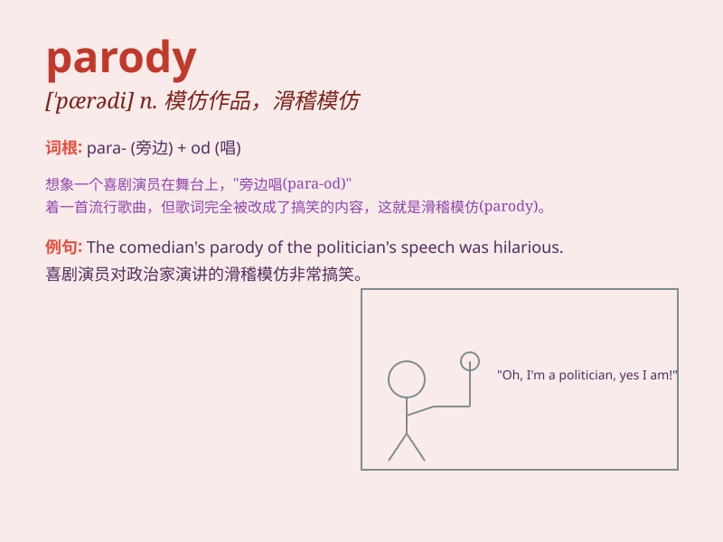

## parody

**英音:** _[\'pærədɪ]_ **美音:** _[\'pærədi]_

**译义:** *n.模仿滑稽作品,拙劣的模仿vt.拙劣模仿*

### 短语

+ **make a parody:** _创作一个模仿作品_

+ **comic parody:** _喜剧性的模仿_

+ **musical parody:** _音乐模仿作品_

+ **parody of a style:** _对一种风格的模仿_

+ **famous parody:** _著名的模仿作品_

### 例句

#### 例句1

> **The comedian\'s performance was a brilliant parody of the
politician\'s speeches.**

**中文翻译:** 这位喜剧演员的表演是对那位政治家演讲的精彩模仿嘲弄。

**单词释义:** 模仿嘲弄

#### 例句2

> **The movie is a parody of classic horror films.**

**中文翻译:** 这部电影是对经典恐怖电影的戏仿。

**单词释义:** 戏仿

#### 例句3

> **She wrote a parody of the popular song to make everyone
laugh.**

**中文翻译:** 她写了一首流行歌曲的滑稽模仿作品来逗大家笑。

**单词释义:** 滑稽模仿作品

### 背诵小故事

> A funny monkey wanted to be a star in a show. It tried to imitate a
famous singer\'s performance, but in a very exaggerated and funny way.
This act was a parody. The monkey made everyone laugh.

**一只滑稽的猴子想在一场表演中成为明星。它试图模仿一位著名歌手的表演，但方式非常夸张和搞笑。这种行为就是戏仿。猴子把大家都逗笑了。**

### 图义

