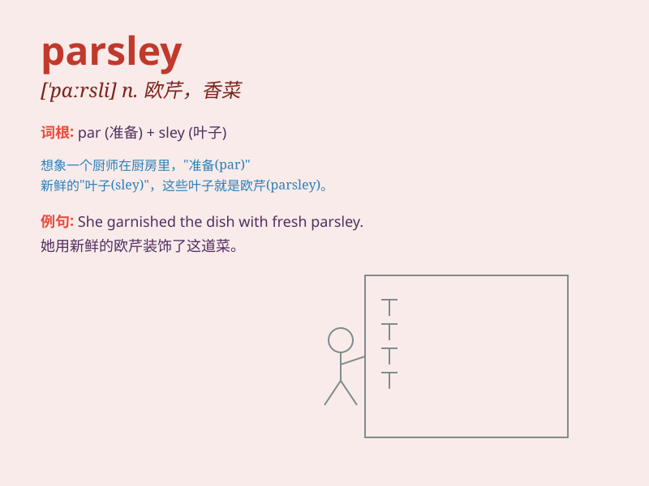

## parsley

**英音:** _[\'pɑːslɪ]_ **美音:** _[\'pɑrsli]_

**译义:** *n.[植]欧芹*

### 短语

+ **fresh parsley:** _新鲜的欧芹_

+ **parsley leaf:** _欧芹叶_

+ **chopped parsley:** _切碎的欧芹_

+ **dried parsley:** _干欧芹_

+ **parsley sauce:** _欧芹酱_

### 例句

#### 例句1

> **I added some chopped parsley to the soup for extra flavor.**

**中文翻译:** 我在汤里加了一些切碎的欧芹以增加风味。

**单词释义:** 欧芹（用于增添食物的风味）

#### 例句2

> **The chef sprinkled parsley on the dish before serving.**

**中文翻译:** 厨师在上菜前在菜上撒了欧芹。

**单词释义:** 欧芹（作为装饰或调味料）

#### 例句3

> **Parsley is often used in Mediterranean cuisine.**

**中文翻译:** 欧芹常用于地中海美食。

**单词释义:** 欧芹（强调其在特定菜系中的使用）

### 背诵小故事

> A little rabbit was very hungry. It found a beautiful garden full of
parsley. It happily ate the parsley and felt full and energetic.
Remember, parsley is the delicious food that made the rabbit happy!

**一只小兔子非常饿。它发现了一个满是欧芹的美丽花园。它开心地吃着欧芹，感到饱饱的且充满活力。记住，parsley
就是让小兔子开心的美味食物！**

### 图义

