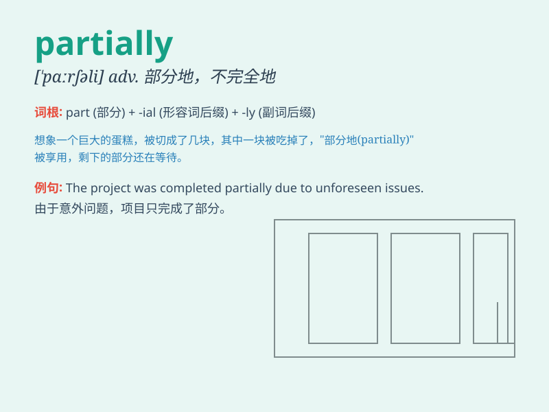

## partially

**英音:** _[\'pɑːʃ(ə)lɪ]_ **美音:** _[\'pɑrʃəli]_

**译义:** *adv.部分地*

### 短语

+ **partially deaf:** _部分失聪_

+ **partially blind:** _部分失明_

+ **partially completed:** _部分完成_

+ **partially damaged:** _部分损坏_

+ **partially responsible:** _部分负责_

### 例句

#### 例句1

> **The room was partially painted.**

**中文翻译:** 房间部分被粉刷过。

**单词释义:** 部分地

#### 例句2

> **She was only partially responsible for the accident.**

**中文翻译:** 她对这起事故只负部分责任。

**单词释义:** 部分地

#### 例句3

> **The view was partially blocked by the trees.**

**中文翻译:** 视线被树木遮挡了一部分。

**单词释义:** 部分地

### 背诵小故事

> A man was partially blind in one eye. He could only see things
partially. But he never gave up and learned to adapt partially to his
condition.

**一个男人一只眼睛部分失明。他只能部分地看到东西。但他从不放弃，并学会部分地适应自己的状况。**

### 图义

