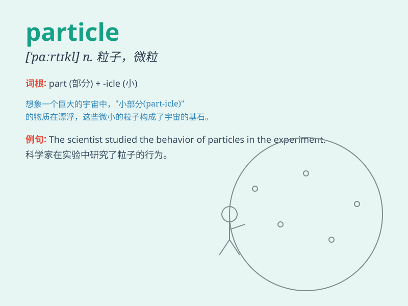

## particle

**英音:** _[\'pɑːtɪk(ə)l]_ **美音:** _[\'pɑrtɪkl]_

**译义:** *n.粒子,点,极小量,微粒,质点,小品词,语气*

### 短语

+ **particle accelerator:** _粒子加速器_

+ **subatomic particle:** _亚原子粒子_

+ **elementary particle:** _基本粒子_

+ **fine particle:** _细颗粒_

+ **particle physics:** _粒子物理学_

### 例句

#### 例句1

> **A particle of dust floated in the air.**

**中文翻译:** 空气中飘浮着一粒灰尘。

**单词释义:** 微粒；颗粒

#### 例句2

> **The physicists are studying subatomic particles.**

**中文翻译:** 物理学家正在研究亚原子粒子。

**单词释义:** 粒子

#### 例句3

> **There was a particle of truth in what he said.**

**中文翻译:** 他说的有一点道理。

**单词释义:** 一点儿；少量

### 背诵小故事

>
想象一个微小的宇宙，里面充满了神秘的particle（粒子）。这些粒子像小精灵一样到处飞舞，它们非常小，小到难以用肉眼看见，但却有着巨大的能量和作用。

**想象一个微小的宇宙，里面充满了神秘的粒子。这些粒子像小精灵一样到处飞舞，它们非常小，小到难以用肉眼看见，但却有着巨大的能量和作用。**

### 图义

