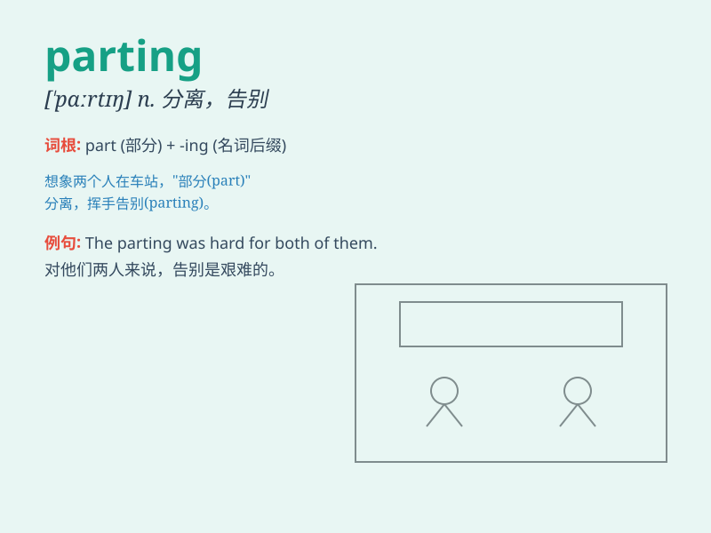

## parting

**英音:** _[\'pɑːtɪŋ]_ **美音:** _[\'pɑrtɪŋ]_

**译义:** *n.分别,分歧处,(头发的)分缝adj.离别的,逝去的*

### 短语

+ **parting shot:** _临告别时说的尖刻话；临走时的最后一击_

+ **parting words:** _告别话_

+ **parting gift:** _临别礼物_

+ **parting line:** _临别赠言；告别台词_

+ **parting glance:** _离别时的一瞥_

### 例句

#### 例句1

> **The parting of friends is always a sad moment.**

**中文翻译:** 朋友的离别总是令人悲伤的时刻。

**单词释义:** 离别；分手

#### 例句2

> **She gave him a parting kiss on the cheek.**

**中文翻译:** 她在他脸颊上吻了一下。

**单词释义:** 离别；分别

#### 例句3

> **The parting words he said still echo in my mind.**

**中文翻译:** 他临别时说的那句话至今仍回荡在我的脑海里。

**单词释义:** 离别时说的话

### 背诵小故事

> A young couple had a tearful parting at the train station. They held
each other tightly, knowing this parting was for a better future. But
the pain of separation was real. The word \'parting\' means the act of
leaving or separating.

**一对年轻情侣在火车站含泪分别。他们紧紧相拥，知道这次分别是为了更美好的未来。但分离的痛苦是真实的。单词'parting'意思是离开或分离的行为。**

### 图义

