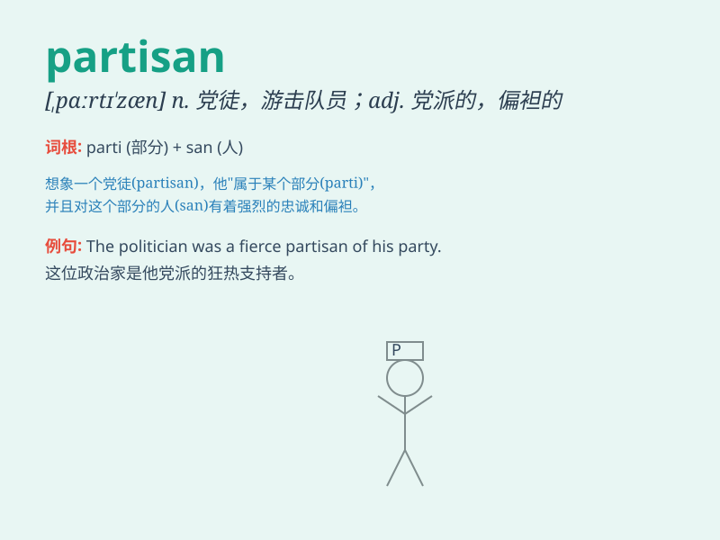

## partisan

**英音:** _[\'pɑːtɪzæn; ,pɑːtɪ\'zæn]_ **美音:**
_[\'pɑrtəzn]_

**译义:** *n.游击队*

### 短语

+ **partisan politics:** _党派政治_

+ **partisan warfare:** _游击战；党派斗争_

+ **partisan bias:** _党派偏见_

+ **partisan support:** _党派支持_

+ **blind partisan:** _盲目的党徒_

### 例句

#### 例句1

> **He has always been a partisan of the conservative party.**

**中文翻译:** 他一直是保守党的支持者。

**单词释义:** 支持者；党徒

#### 例句2

> **The report was highly partisan and failed to present a balanced
view.**

**中文翻译:** 该报告党派色彩浓厚，未能提出平衡的观点。

**单词释义:** 偏袒的；有党派偏见的

#### 例句3

> **The debate became increasingly partisan, with each side refusing
to listen to the other.**

**中文翻译:** 辩论变得越来越党派化，双方都拒绝听取对方的意见。

**单词释义:** 党派性的

### 背诵小故事

>
在战争时期，有个勇敢的士兵，他始终坚定地支持自己的队伍，毫不退缩，大家都称他为partisan。他就像队伍的旗帜，引领大家勇往直前。

**在战争时期，有个坚定支持自己队伍的勇敢士兵，大家称他为"党派支持者；党徒；坚决支持者"。**

### 图义

