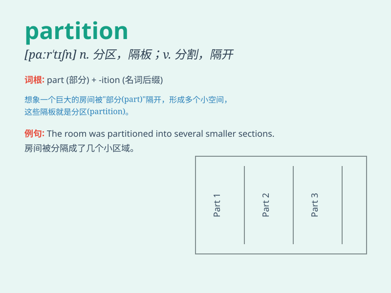

## partition

**英音:** _[pɑː\'tɪʃ(ə)n]_ **美音:** _[pɑr\'tɪʃən]_

**译义:** *n.分割,划分,瓜分,分开,隔离物vt.区分,隔开,分割*

### 短语

+ **partition wall:** _隔墙；隔断墙_

+ **partition off:** _隔开；分隔_

+ **partition table:** _分区表_

+ **memory partition:** _内存分区_

+ **disk partition:** _磁盘分区_

### 例句

#### 例句1

> **The room was partitioned into two sections by a curtain.**

**中文翻译:** 房间被帘子分成两部分。

**单词释义:** 分隔；划分

#### 例句2

> **The partition of the estate caused a lot of disputes among the
heirs.**

**中文翻译:** 遗产分割引发了继承人之间的诸多纠纷。

**单词释义:** 分割；瓜分

#### 例句3

> **A glass partition separated the office area from the meeting
room.**

**中文翻译:** 办公区和会议室之间用玻璃隔断隔开。

**单词释义:** 隔板；隔断

### 背诵小故事

> A king needed to partition his kingdom among his sons. He drew lines
on a map to divide it evenly. This act of dividing was called
\'partition\'.

**一位国王需要在他的儿子们之间划分他的王国。他在地图上画线来平均分割。这种划分的行为就被称为'partition'。**

### 图义

