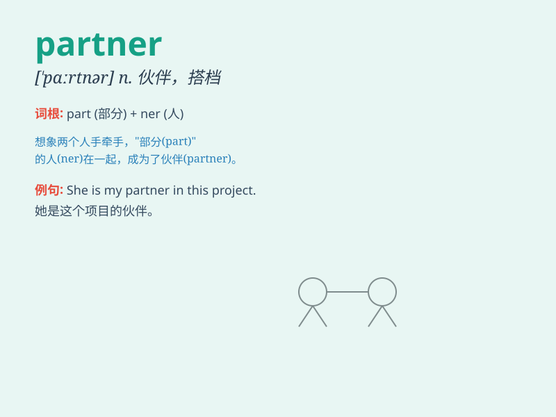

## partner

**英音:** _[\'pɑːtnə]_ **美音:** _[ˈpɑːrtnər]_

**译义:**
*n.合伙人,股东,舞伴,伴侣vt.与\...合伙,组成一对vi.做伙伴,当助手*

### 短语

+ **business partner:** _商业伙伴_

+ **life partner:** _生活伴侣_

+ **trading partner:** _贸易伙伴_

+ **dance partner:** _舞伴_

+ **partnership agreement:** _合作协议_

### 例句

#### 例句1

> **My business partner and I have been working together for five
years.**

**中文翻译:** 我和我的商业伙伴已经合作五年了。

**单词释义:** 伙伴；合伙人

#### 例句2

> **She is my dance partner in the competition.**

**中文翻译:** 她是我在比赛中的舞伴。

**单词释义:** 伙伴；搭档

#### 例句3

> **The company is looking for a new partner to expand its
market.**

**中文翻译:** 该公司正在寻找新的合作伙伴来扩大其市场。

**单词释义:** 合作伙伴

### 背诵小故事

> Once upon a time, a lonely artist was seeking a partner to create
beautiful art together. Finally, he found a like-minded friend. With
their teamwork, they achieved great success. \'Partner\' means someone
you work or do something with.

**从前，有一位孤独的艺术家一直在寻找一个伙伴一起创作美丽的艺术。最终，他找到了志同道合的朋友。凭借他们的团队合作，取得了巨大的成功。\'Partner\'意思是与你一起工作或做事的人。**

### 图义

