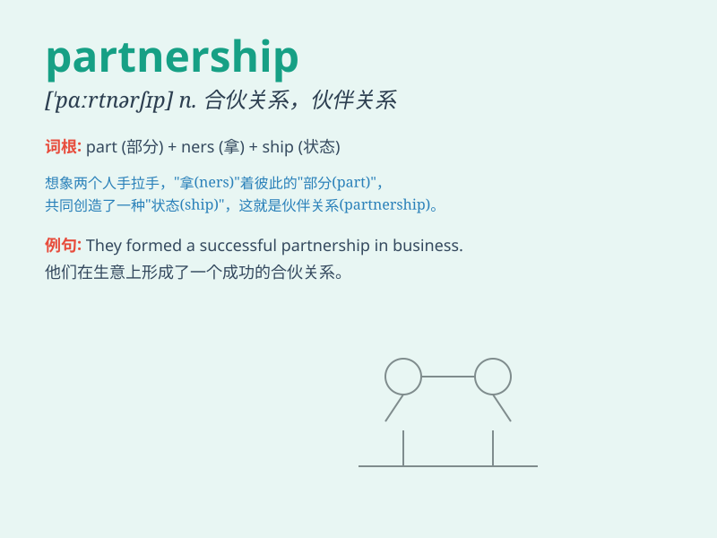

## partnership

**英音:** _[\'pɑːtnəʃɪp]_ **美音:** _[\'pɑrtnɚʃɪp]_

**译义:**
*n.合伙,合股,合伙企业,合伙契约,[体]队友关系,(双人项目的)配对*

### 短语

+ **strategic partnership:** _战略伙伴关系_

+ **business partnership:** _商业伙伴关系_

+ **partnership agreement:** _合作协议；伙伴协议_

+ **limited partnership:** _有限合伙_

+ **general partnership:** _普通合伙_

### 例句

#### 例句1

> **The partnership between the two companies has been very
successful.**

**中文翻译:** 两家公司之间的合作非常成功。

**单词释义:** 合作关系

#### 例句2

> **They decided to form a partnership to start a new business.**

**中文翻译:** 他们决定建立合伙企业来开展新业务。

**单词释义:** 合作关系

#### 例句3

> **The partnership broke up due to differences in management
styles.**

**中文翻译:** 由于管理风格的差异，合伙企业破裂了。

**单词释义:** 合作关系

### 背诵小故事

> Once upon a time, two friends, Tom and Jerry, decided to start a
business together. They formed a partnership, sharing both profits and
risks. With hard work and mutual trust, their partnership grew stronger
and more successful.

**从前，两个朋友汤姆和杰瑞决定一起创业。他们建立了伙伴关系，共同分享利润和承担风险。通过努力工作和相互信任，他们的伙伴关系变得更强大、更成功。**

### 图义

