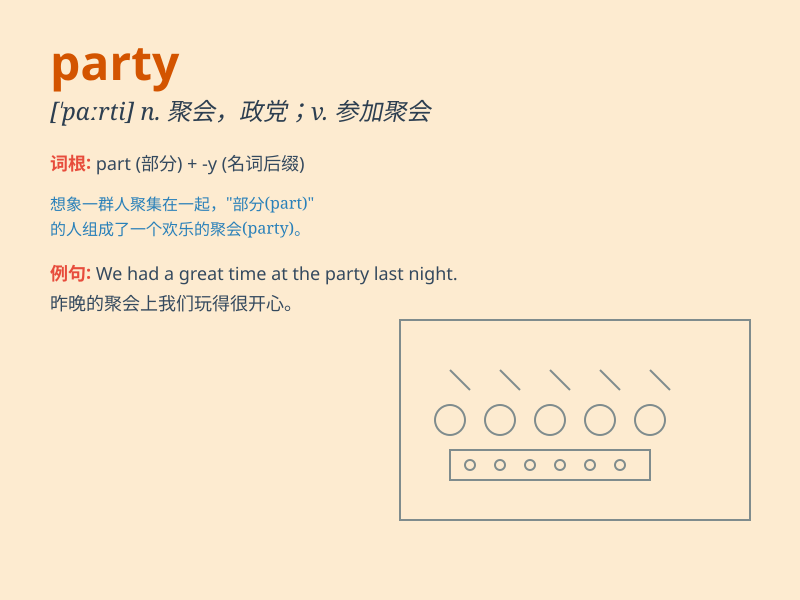

## party

**英音:** _[\'pɑːtɪ]_ **美音:** _[\'pɑrti]_

**译义:** *n.党,政党,随行人员,[律]当事人,社交会*

### 短语

+ **birthday party:** _生日聚会_

+ **dinner party:** _晚宴_

+ **political party:** _政党_

+ **house party:** _家庭聚会_

+ **garden party:** _游园会_

### 例句

#### 例句1

> **We had a great party last night.**

**中文翻译:** 昨晚我们举行了一场盛大的聚会。

**单词释义:** 聚会

#### 例句2

> **He is a member of the Democratic Party.**

**中文翻译:** 他是民主党成员。

**单词释义:** 政党

#### 例句3

> **The two groups decided to party together.**

**中文翻译:** 两组人决定一起聚会。

**单词释义:** 玩乐；狂欢

### 背诵小故事

> A group of friends decided to have a party. They decorated the room,
played music, and ate delicious food. Everyone had a great time and the
party was full of joy and laughter.

**一群朋友决定举办一个聚会。他们装饰房间、播放音乐并且吃美味的食物。每个人都玩得很开心，聚会充满了欢乐和笑声。**

### 图义

