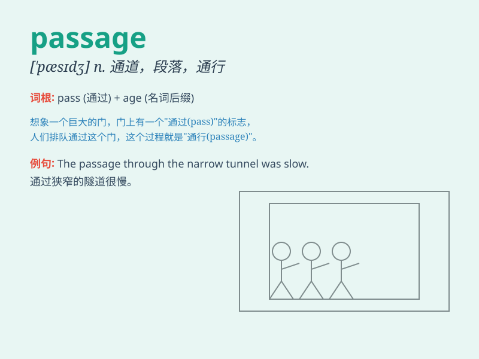

## passage

**英音:** _[\'pæsɪdʒ]_ **美音:** _[\'pæsɪdʒ]_

**译义:** *n.通过,经过,通道,通路,(一)段,(一)节*

### 短语

+ **passage of time:** _时间的流逝_

+ **safe passage:** _安全通道；安全通行_

+ **passage from\...to\...:** _从\...\...到\...\...的通道_

+ **book passage:** _预订船票（或机票等）_

+ **passage through:** _穿过；通过_

### 例句

#### 例句1

> **The passage of time is inevitable.**

**中文翻译:** 时间的流逝是不可避免的。

**单词释义:** 流逝；推移

#### 例句2

> **She read a passage from the book.**

**中文翻译:** 她读了书中的一段话。

**单词释义:** 一段（文章）

#### 例句3

> **The narrow passage was crowded with people.**

**中文翻译:** 狭窄的通道里挤满了人。

**单词释义:** 通道；走廊

### 背诵小故事

> A brave mouse wanted to find a new home. It had to go through a long
passage full of obstacles. Finally, it succeeded and found a cozy place.
The passage was like a challenging journey for the mouse.

**一只勇敢的老鼠想要寻找一个新家。它必须穿过一条充满障碍的长长的通道。最后，它成功了，并找到了一个舒适的地方。这条通道对于老鼠来说就像是一次充满挑战的旅程。**

### 图义

