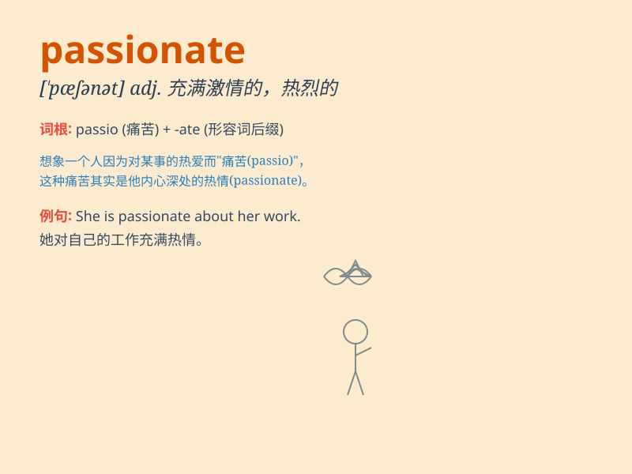

## passionate

**英音:** _[\'pæʃ(ə)nət]_ **美音:** _[\'pæʃənət]_

**译义:** *adj.充满热情的*

### 短语

+ **passionate love:** _热烈的爱情_

+ **passionate speech:** _充满激情的演讲_

+ **passionate advocate:** _热情的倡导者_

+ **passionate interest:** _强烈的兴趣_

+ **passionate musician:** _充满激情的音乐家_

### 例句

#### 例句1

> **She is passionate about music and spends hours playing the piano
every day.**

**中文翻译:** 她对音乐充满热情，每天花几个小时弹钢琴。

**单词释义:** 充满热情的

#### 例句2

> **His passionate speech inspired the audience to take action.**

**中文翻译:** 他充满激情的演讲激励了听众采取行动。

**单词释义:** 热情的；激昂的

#### 例句3

> **They have a passionate love affair that lasts for years.**

**中文翻译:** 他们有一段持续多年的热烈爱情。

**单词释义:** 热烈的；多情的

### 背诵小故事

> A passionate artist spent days and nights creating a masterpiece. He
was so passionate that he forgot to eat or sleep. His passion drove him
to keep perfecting his work until it was truly amazing.

**一位充满激情的艺术家日夜不停地创作一幅杰作。他如此充满激情，以至于忘记了吃饭和睡觉。他的激情驱使他不断完善自己的作品，直到它真正令人惊叹。**

### 图义

