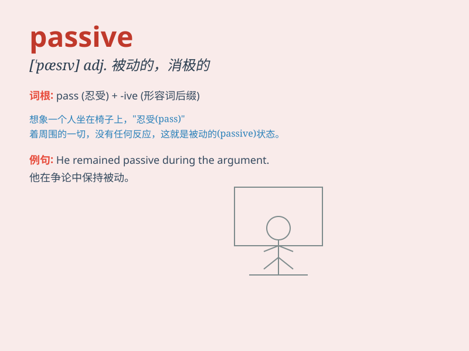

## passive

**英音:** _[\'pæsɪv]_ **美音:** _[\'pæsɪv]_

**译义:** *adj.被动的*

### 短语

+ **passive smoking:** _被动吸烟；吸二手烟_

+ **passive voice:** _被动语态_

+ **passive income:** _被动收入；非劳动收入_

+ **passive resistance:** _消极抵抗；非暴力抵抗_

+ **passive safety:** _被动安全_

### 例句

#### 例句1

> **She took a passive role in the meeting.**

**中文翻译:** 她在会议中扮演了被动的角色。

**单词释义:** 被动的

#### 例句2

> **His passive attitude made the project progress slowly.**

**中文翻译:** 他的消极态度使得项目进展缓慢。

**单词释义:** 消极的

#### 例句3

> **The passive voice is often used in scientific writing.**

**中文翻译:** 被动语态经常用于科学写作中。

**单词释义:** 被动（语态）的

### 背诵小故事

> A little mouse was always passive when facing the big cat. It never
fought back but just hid. But one day, it decided to be brave. Now you
know passive means accepting without active response.

**一只小老鼠在面对大猫时总是很被动。它从不反击，只是躲藏。但有一天，它决定勇敢起来。现在你知道
passive 意思是消极接受，不主动回应。**

### 图义

