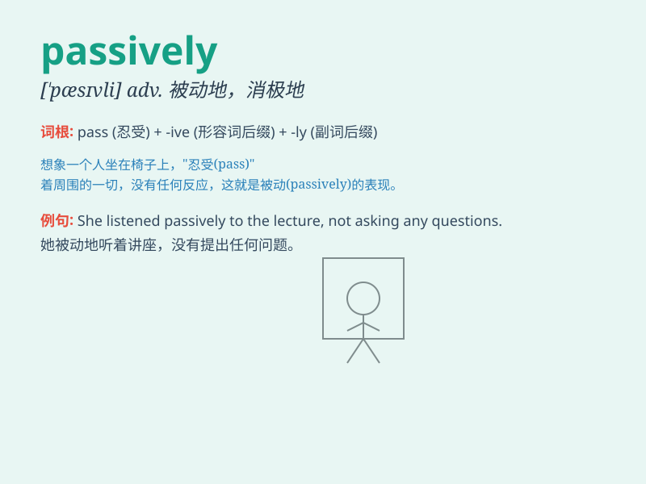

## passively

**英音:** _[\'pæsɪvli]_ **美音:** _[\'pæsɪvli]_

**译义:** *adv.被动地,顺从地*

### 短语

+ **passively wait:** _被动地等待_

+ **passively accept:** _被动地接受_

+ **passively observe:** _被动地观察_

+ **passively listen:** _被动地倾听_

+ **passively follow:** _被动地跟随_

### 例句

#### 例句1

> **She just sat there passively, not participating in the
discussion.**

**中文翻译:** 她只是被动地坐在那里，不参与讨论。

**单词释义:** 被动地

#### 例句2

> **The audience listened passively to the long speech.**

**中文翻译:** 听众被动地听着长篇演讲。

**单词释义:** 消极地；被动地

#### 例句3

> **He accepted the situation passively without trying to change
it.**

**中文翻译:** 他被动地接受了现状，没有试图去改变。

**单词释义:** 消极地；顺从地

### 背诵小故事

> One day, a little rabbit was watching a magic show passively. It just
sat there without any reaction. But when the magician asked for active
participation, the rabbit remained still. Finally, it missed all the
fun.

**有一天，一只小兔子在被动地观看一场魔术表演。它就坐在那里毫无反应。但当魔术师要求积极参与时，兔子仍然一动不动。最后，它错过了所有的乐趣。**

### 图义

