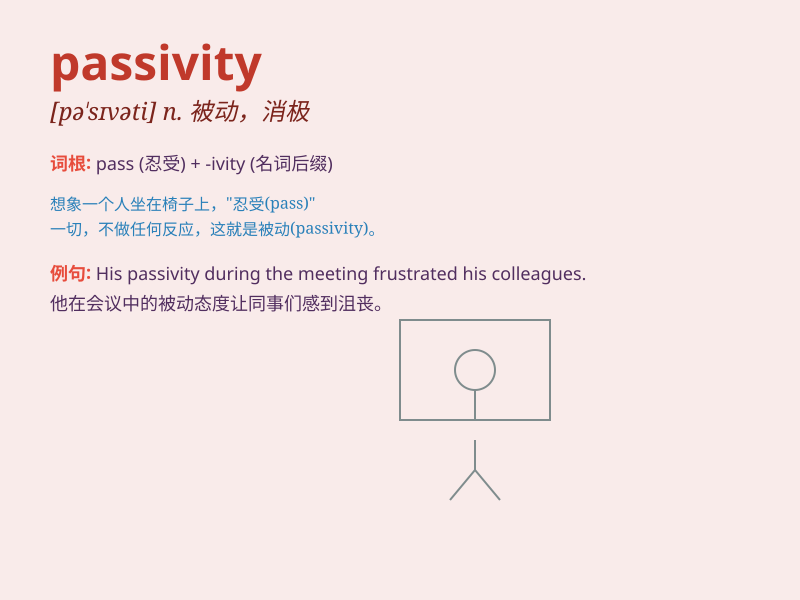

## passivity

**英音:** _[pæ\'sɪvɪtɪ]_ **美音:** _[pæ\'sɪvəti]_

**译义:** *n.被动性*

### 短语

+ **passivity syndrome:** _被动性综合征_

+ **fall into passivity:** _陷入被动_

+ **excessive passivity:** _过度被动_

+ **break through passivity:** _突破被动_

+ **avoid passivity:** _避免被动_

### 例句

#### 例句1

> **His passivity in the face of difficulties was quite
frustrating.**

**中文翻译:** 他在困难面前的消极态度令人沮丧。

**单词释义:** 消极被动

#### 例句2

> **The passivity of the audience made the performance less
exciting.**

**中文翻译:** 观众的被动让表演变得不那么精彩。

**单词释义:** 消极态度

#### 例句3

> **We should avoid passivity and take the initiative to solve
problems.**

**中文翻译:** 我们应该避免被动，主动解决问题。

**单词释义:** 消极被动

### 背诵小故事

> A lazy cat always shows passivity. It just lies around and doesn\'t
move to catch mice. One day, when there was no food left, it still
remained passive and ended up hungry.

**一只懒猫总是表现出被动性。它只是躺在周围，不动去抓老鼠。有一天，当没有食物剩下时，它仍然很被动，最后挨饿了。**

### 图义

