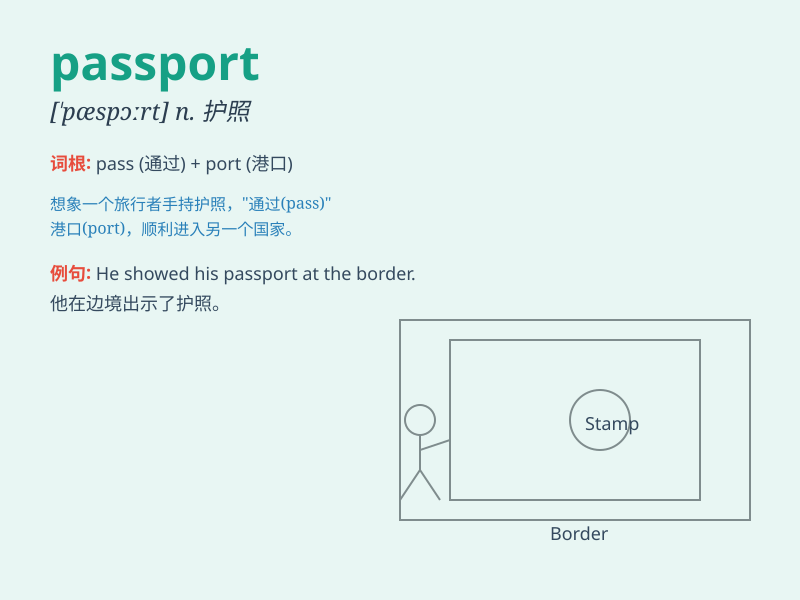

## passport

**英音:** _[\'pɑːspɔːt]_ **美音:** _[\'pæspɔrt]_

**译义:** *n.护照*

### 短语

+ **passport control:** _护照检查处_

+ **passport photo:** _护照照片_

+ **passport number:** _护照号码_

+ **valid passport:** _有效护照_

+ **lost passport:** _丢失的护照_

### 例句

#### 例句1

> **I need to renew my passport before my trip.**

**中文翻译:** 我需要在旅行前更新护照。

**单词释义:** 护照

#### 例句2

> **He showed his passport at the customs.**

**中文翻译:** 他在海关出示了护照。

**单词释义:** 护照

#### 例句3

> **Her passport was stolen on the train.**

**中文翻译:** 她的护照在火车上被偷了。

**单词释义:** 护照

### 背诵小故事

> One day, Tom was excited to travel abroad. But he couldn\'t board the
plane without his passport. He frantically searched everywhere and
finally found it in his jacket pocket. With the passport in hand, he
happily embarked on his journey.

**有一天，汤姆兴奋地准备出国旅行。但没有护照他就无法登机。他疯狂地到处找，最后在他的夹克口袋里找到了。拿着护照，他愉快地踏上了旅程。**

### 图义

