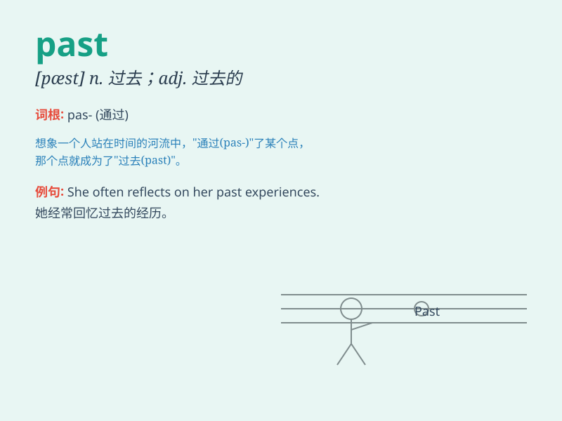

## past

**英音:** _[pɑːst]_ **美音:** _[pæst]_

**译义:** *n.过去,往时adj.过去的,结束的 prep.越过,晚于
vbl.pass的过去分词*

### 短语

+ **in the past:** _在过去；以往_

+ **past experience:** _过去的经验_

+ **past tense:** _过去时；过去时态_

+ **go past:** _经过；路过_

+ **past master:** _行家；老手_

### 例句

#### 例句1

> **I walked past the park yesterday.**

**中文翻译:** 我昨天走过公园。

**单词释义:** 经过

#### 例句2

> **The past few days have been very busy.**

**中文翻译:** 过去几天非常忙碌。

**单词释义:** 过去的

#### 例句3

> **She has a painful past.**

**中文翻译:** 她有一段痛苦的过去。

**单词释义:** 过去；往昔

### 背诵小故事

> One day, a little boy was running. He passed a big tree. The time he
spent running was in the past. But the memory of that moment stayed with
him.

**有一天，一个小男孩在跑步。他经过了一棵大树。他跑步所花费的时间已成过去。但那一刻的记忆留在了他心中。**

### 图义

