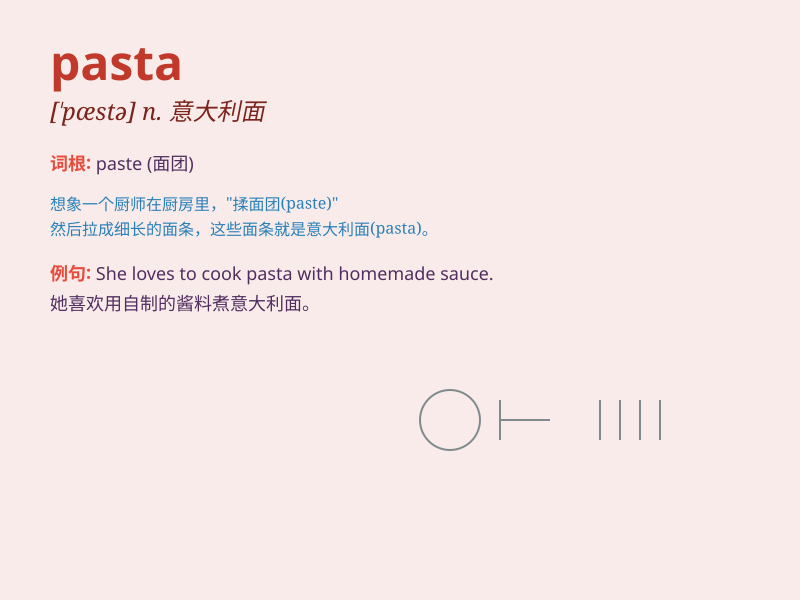

## pasta

**英音:** _[\'pæstə]_ **美音:** _[\'pɑstə]_

**译义:** *n.意大利面制品,意大利面食(包括通心粉及面条等)*

### 短语

+ **pasta salad:** _意面沙拉_

+ **pasta dish:** _意面菜肴_

+ **fresh pasta:** _新鲜的意面_

+ **dry pasta:** _干意面_

+ **pasta sauce:** _意面酱_

### 例句

#### 例句1

> **I love eating pasta with tomato sauce.**

**中文翻译:** 我喜欢吃番茄酱意大利面。

**单词释义:** 意大利面

#### 例句2

> **The pasta in this restaurant is very delicious.**

**中文翻译:** 这家餐厅的面食非常好吃。

**单词释义:** 意大利面

#### 例句3

> **She cooked a big bowl of pasta for dinner.**

**中文翻译:** 她做了一大碗意大利面作为晚餐。

**单词释义:** 意大利面

### 背诵小故事

> One day, I was very hungry. I went to a restaurant and ordered a big
plate of pasta. The pasta looked like long, curly ribbons and tasted
delicious. It filled my stomach and made me happy.

**有一天，我非常饿。我去了一家餐馆，点了一大盘意大利面。意大利面看起来像长长的卷曲丝带，味道很美味。它填饱了我的肚子，让我很开心。**

### 图义

