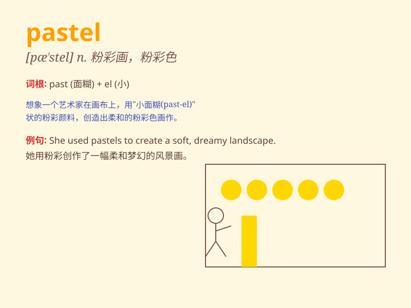

## pastel

**英音:** _[\'pæst(ə)l]_ **美音:** _[pæ\'stɛl]_

**译义:** *n.彩色蜡笔,彩色蜡笔画adj.彩色蜡笔的,柔和的*

### 短语

+ **pastel color:** _柔和的色彩_

+ **pastel drawing:** _彩色蜡笔画_

+ **pastel shade:** _淡色调_

+ **pastel tone:** _柔和的色调_

+ **pastel pink:** _淡粉色_

### 例句

#### 例句1

> **She wore a pastel dress to the party.**

**中文翻译:** 她穿着一件柔和的连衣裙去参加聚会。

**单词释义:** 淡色的；柔和的

#### 例句2

> **The artist used pastels to create a beautiful landscape.**

**中文翻译:** 艺术家用粉彩创造了一幅美丽的风景。

**单词释义:** 彩色粉笔；蜡笔

#### 例句3

> **The room was decorated in pastel colors.**

**中文翻译:** 房间以柔和的色彩装饰。

**单词释义:** 淡色；柔和色

### 背诵小故事

> A painter was known for using pastel colors. One day, a little girl
watched him create a beautiful garden scene with soft pastels. The
painter explained that pastel gives a gentle and dreamy look. The girl
was amazed.

**一位画家以使用柔和的色彩而闻名。有一天，一个小女孩看着他用柔和的蜡笔创作了一幅美丽的花园场景。画家解释说蜡笔能呈现出温柔梦幻的效果。小女孩感到很惊奇。**

### 图义

