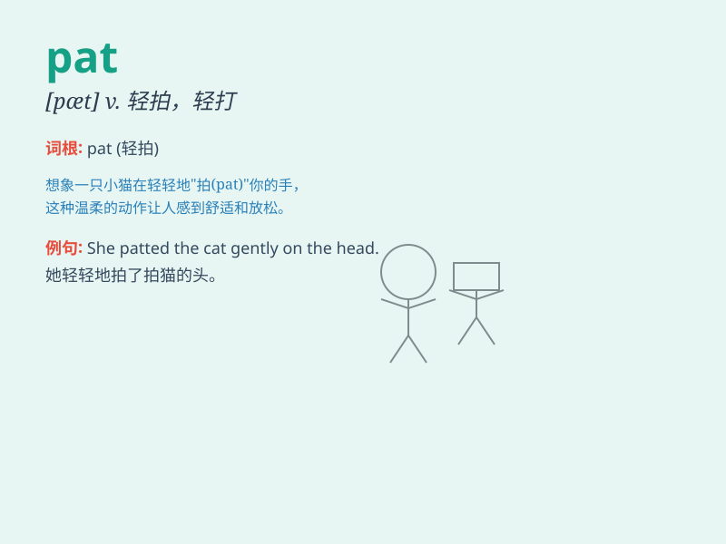

## pat

**英音:** _[pæt]_ **美音:** _[pæt]_

**译义:**
*n.轻拍,(黄油)小块v.轻拍adv.适时,正好,恰好adj.恰好的,合适的,人为的*

### 短语

+ **pat on the back:** _赞扬；表扬_

+ **stand pat:** _坚持不变；固执己见_

+ **pat oneself on the back:** _自我表扬；沾沾自喜_

+ **a pat answer:** _脱口而出的回答；不假思索的回答_

+ **pat down:** _（用手）轻轻拍打以搜查_

### 例句

#### 例句1

> **She gave the dog a pat on the head.**

**中文翻译:** 她拍拍狗的头。

**单词释义:** 轻拍

#### 例句2

> **He received a pat on the back for his hard work.**

**中文翻译:** 由于他的辛勤工作，他受到了表扬。

**单词释义:** 表扬；称赞

#### 例句3

> **The mother patted the child to sleep.**

**中文翻译:** 妈妈拍拍孩子睡觉。

**单词释义:** 轻拍

### 背诵小故事

> A little cat was lost. A kind girl found it and gave it a gentle pat
on the head. The cat felt comforted and followed the girl home. \'Pat\'
means to touch someone or something gently and briefly.

**一只小猫迷路了。一个善良的女孩发现了它，并轻轻拍了拍它的头。小猫感到很安慰，跟着女孩回了家。\'pat\'意思是轻轻地、短暂地触摸某人或某物。**

### 图义

