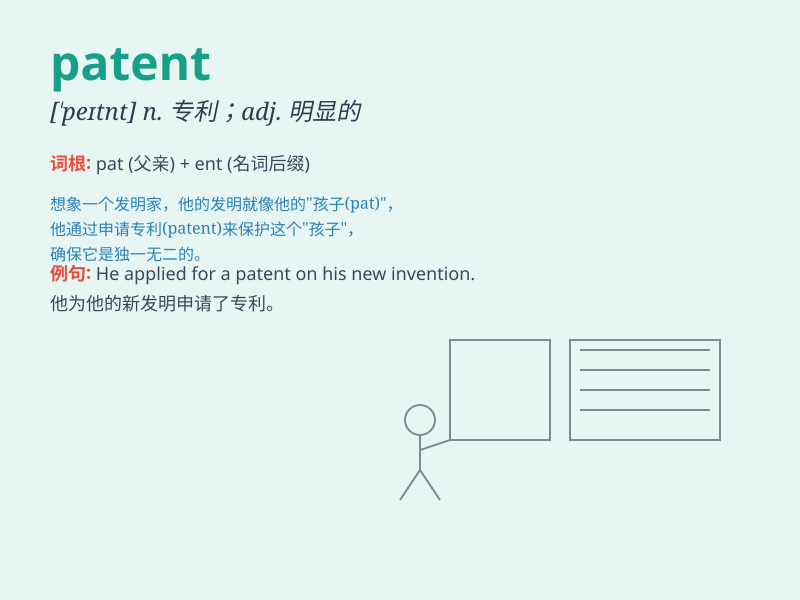

## patent

**英音:** _[\'pæt(ə)nt; \'peɪt(ə)nt]_ **美音:**
_[\'pætnt]_

**译义:**
*n.专利权,执照,专利品adj.特许的,专利的,显著的,明白的,新奇的vt.取得\...的专利权,请准专利*

### 短语

+ **patent application:** _专利申请_

+ **patent office:** _专利局_

+ **patent law:** _专利法_

+ **patent right:** _专利权_

+ **obtain a patent:** _获得专利_

### 例句

#### 例句1

> **The invention was protected by a patent.**

**中文翻译:** 该发明受专利保护。

**单词释义:** 专利

#### 例句2

> **He has a patent for his new design.**

**中文翻译:** 他的新设计拥有专利。

**单词释义:** 专利

#### 例句3

> **The machine works by a patented process.**

**中文翻译:** 该机器采用专利工艺工作。

**单词释义:** 专利的

### 背诵小故事

> A scientist spent years working on a new invention. Finally, he got a
patent. It was like a special key that opened the door to success and
protected his idea from being copied.

**一位科学家花了数年时间研究一项新发明。最终，他获得了专利。这就像一把特殊的钥匙，打开了成功之门，并保护他的想法不被抄袭。**

### 图义

