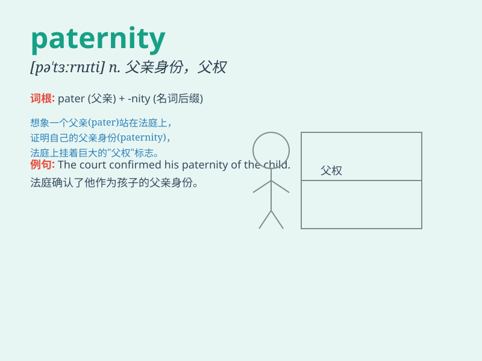

## paternity

**英音:** _[pə\'tɜːnɪtɪ]_ **美音:** _[pə\'tɝnəti]_

**译义:** *n.父权,父子关系*

### 短语

+ **paternity leave:** _陪产假_

+ **paternity suit:** _生父确认诉讼_

+ **paternity test:** _亲子鉴定_

+ **establish paternity:** _确立亲子关系_

+ **deny paternity:** _否认亲子关系_

### 例句

#### 例句1

> **He was denied paternity of the child.**

**中文翻译:** 他被否认是孩子的父亲。

**单词释义:** 父亲的身份；父系

#### 例句2

> **The paternity test confirmed his suspicion.**

**中文翻译:** 亲子鉴定证实了他的怀疑。

**单词释义:** 父亲身份的确定

#### 例句3

> **She sought legal recognition of paternity.**

**中文翻译:** 她寻求法律承认亲子关系。

**单词释义:** 父亲身份

### 背诵小故事

> A man was very worried about the paternity of the child. He did a DNA
test and finally confirmed his fatherhood. It was a relief as paternity
was established and he could take responsibility for his child.

**一个男人非常担心孩子的亲子关系。他做了 DNA
检测，最终确认了他的父亲身份。当亲子关系得以确定，他可以为孩子负责时，他松了一口气。**

### 图义

