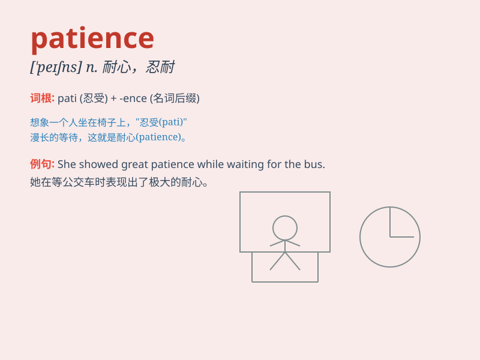

## patience

**英音:** _[\'peɪʃ(ə)ns]_ **美音:** _[\'peʃns]_

**译义:** *n.耐性,忍耐 Patience 佩兴斯(女子名)*

### 短语

+ **have patience:** _有耐心_

+ **lose patience:** _失去耐心_

+ **test one\'s patience:** _考验某人的耐心_

+ **be out of patience:** _不耐烦；失去耐心_

+ **with patience:** _耐心地_

### 例句

#### 例句1

> **She has the patience to teach children with special needs.**

**中文翻译:** 她有耐心教导有特殊需要的孩子。

**单词释义:** 耐心

#### 例句2

> **Learning a new language requires patience.**

**中文翻译:** 学习一门新语言需要耐心。

**单词释义:** 耐心

#### 例句3

> **His patience was wearing thin after waiting for hours.**

**中文翻译:** 等了几个小时后，他的耐心逐渐消失。

**单词释义:** 耐心

### 背诵小故事

> A little boy wanted to catch a beautiful butterfly. But it kept
flying away. He waited patiently for hours and finally caught it. His
patience paid off.

**一个小男孩想要抓住一只漂亮的蝴蝶。但它一直飞走。他耐心地等了几个小时，最终抓住了它。他的耐心得到了回报。**

### 图义

