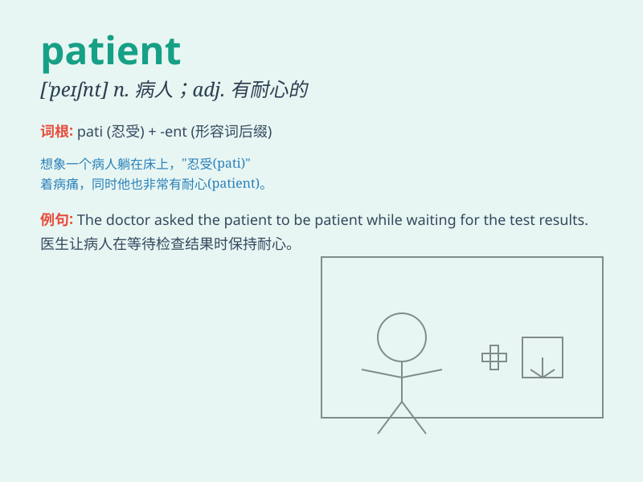

## patient

**英音:** _[\'peɪʃ(ə)nt]_ **美音:** _[ˈpeʃənt]_

**译义:** *n.病人,患者adj.忍耐的,耐心的*

### 短语

+ **be patient with:** _对\...\...有耐心_

+ **patient care:** _病人护理_

+ **mental patient:** _精神病人_

+ **outpatient department:** _门诊部_

+ **inpatient treatment:** _住院治疗_

### 例句

#### 例句1

> **The doctor is very patient with the elderly patients.**

**中文翻译:** 医生对老年患者非常有耐心。

**单词释义:** 有耐心的

#### 例句2

> **You need to be patient when waiting in line.**

**中文翻译:** 排队等候时需要有耐心。

**单词释义:** 有耐心的

#### 例句3

> **The patient has been recovering slowly.**

**中文翻译:** 病人一直在缓慢康复。

**单词释义:** 病人

### 背诵小故事

> A doctor was very busy, but one patient was very understanding and
waited patiently without complaint. The patient\'s patience made the
doctor feel grateful.

**一位医生非常忙碌，但有一位病人非常理解，毫无怨言地耐心等待。这位病人的耐心让医生感到感激。**

### 图义

