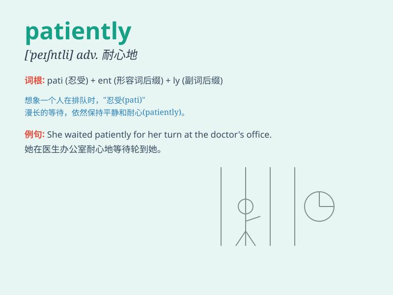

## patiently

**英音:** _[\'peɪʃntli]_ **美音:** _[\'peʃəntli]_

**译义:** *adv.有耐性地,有毅力地*

### 短语

+ **wait patiently:** _耐心等待_

+ **listen patiently:** _耐心倾听_

+ **explain patiently:** _耐心解释_

+ **work patiently:** _耐心工作_

+ **study patiently:** _耐心学习_

### 例句

#### 例句1

> **He waited patiently for his turn.**

**中文翻译:** 他耐心地等待轮到他。

**单词释义:** 耐心地

#### 例句2

> **The doctor listened patiently to the patient\'s complaints.**

**中文翻译:** 医生耐心地听取病人的诉说。

**单词释义:** 耐心地

#### 例句3

> **She answered the children\'s questions patiently.**

**中文翻译:** 她耐心地解答了孩子们的问题。

**单词释义:** 耐心地

### 背诵小故事

> One day, a little boy was waiting for his ice cream patiently. Even
though it took a long time, he didn\'t complain or get angry. His
patience finally paid off when he got the delicious ice cream.

**一天，一个小男孩在耐心地等待他的冰淇淋。尽管等了很长时间，他既没有抱怨也没有生气。最终他的耐心得到了回报，他拿到了美味的冰淇淋。**

### 图义

