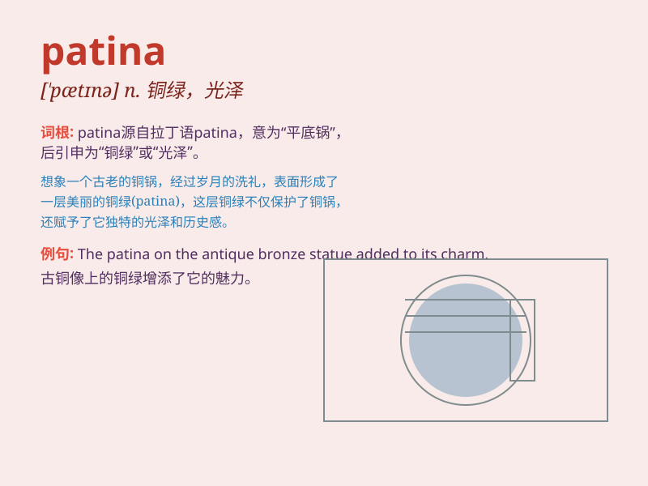

## patina

**英音:** _[\'pætɪnə]_ **美音:** _[pə\'tinə]_

**译义:** *n.铜绿,绿锈,薄层,光泽,古色*

### 短语

+ **patina of age:** _岁月的痕迹_

+ **acquire a patina:** _获得一层光泽_

+ **patina of wisdom:** _智慧的光泽_

+ **a patina of dust:** _一层灰尘_

+ **the patina of experience:** _经验的痕迹_

### 例句

#### 例句1

> **The old bronze statue had a beautiful patina that added to its
charm.**

**中文翻译:** 这座古老的青铜雕像有着美丽的铜绿，增添了它的魅力。

**单词释义:** 铜绿；（木器、金属等表面的）氧化层；光泽

#### 例句2

> **The years had given the furniture a patina of wisdom and
experience.**

**中文翻译:** 岁月赋予了家具智慧和经验的光泽。

**单词释义:** （因年久而产生的）外表光泽；古色

#### 例句3

> **His face had a patina of weariness after a long day at work.**

**中文翻译:** 经过一整天的工作后，他的脸上露出了疲倦的铜绿。

**单词释义:** （因经历或习惯而形成的）神情；外观

### 背诵小故事

>
想象一位古老的工匠，他精心打造的铜器放置多年。岁月流逝，铜器表面形成了一层独特的绿锈，这层绿锈就是patina。它就像时间留下的美丽痕迹，见证了岁月的变迁。

**想象一位老工匠打造的铜器多年后表面形成的绿锈叫patina，像时间的美丽痕迹，见证变迁。**

### 图义

