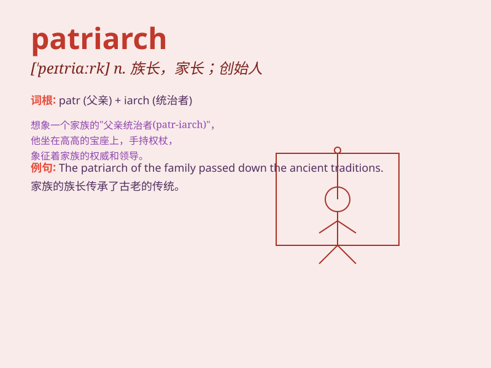

## patriarch

**英音:** _[\'peɪtrɪɑːk]_ **美音:** _[\'petrɪɑrk]_

**译义:** *n.家长,族长,创办人,最年长者*

### 短语

+ **patriarch system:** _家长制；父权制_

+ **patriarch society:** _父权社会_

+ **family patriarch:** _家族族长_

+ **ecclesiastical patriarch:** _教会大牧首_

+ **patriarch figure:** _家长式人物_

### 例句

#### 例句1

> **The patriarch of the family made the final decision.**

**中文翻译:** 最终的决定是由家族族长做出的。

**单词释义:** 族长；家长

#### 例句2

> **The church patriarch delivered a powerful sermon.**

**中文翻译:** 教会主教发表了强有力的布道。

**单词释义:** 元老；前辈

#### 例句3

> **The patriarch of the tribe led the migration.**

**中文翻译:** 部落的族长带领着这次迁徙。

**单词释义:** 首领；酋长

### 背诵小故事

> In a distant village, there was a wise old man known as the
patriarch. He guided the villagers with his experience and wisdom.
Everyone respected him as the leader of the family and the community.

**在一个遥远的村庄里，有一位睿智的老人被称为族长。他凭借自己的经验和智慧为村民们指引方向。每个人都尊敬他，视他为家族和社区的领袖。**

### 图义

