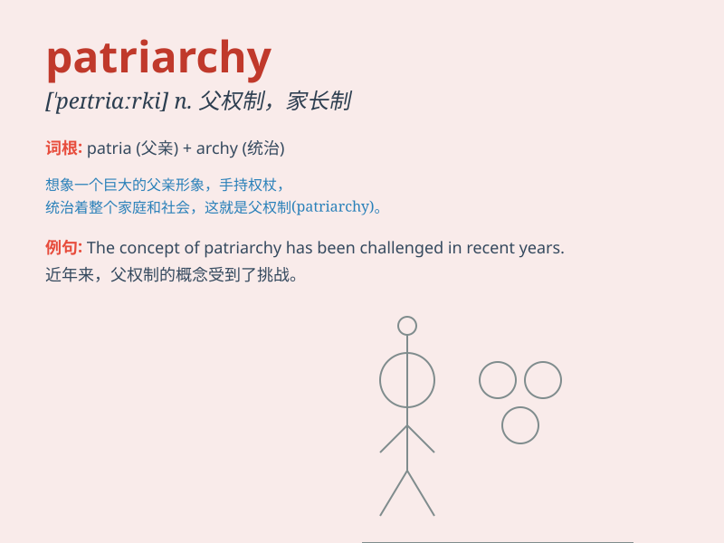

## patriarchy

**英音:** _[\'peɪtrɪɑːkɪ]_ **美音:** _[\'petrɪɑrki]_

**译义:** *n.家长统治,父权制*

### 短语

+ **patriarchal society:** _父权社会_

+ **patriarchy system:** _父权制体系_

+ **oppose patriarchy:** _反对父权制_

+ **challenge patriarchy:** _挑战父权制_

+ **break down patriarchy:** _打破父权制_

### 例句

#### 例句1

> **The society has long been dominated by patriarchy.**

**中文翻译:** 长期以来，社会一直处于父权制的统治之下。

**单词释义:** 父权制

#### 例句2

> **She criticized the patriarchy for limiting women\'s
opportunities.**

**中文翻译:** 她批评父权制限制妇女的机会。

**单词释义:** 父权制

#### 例句3

> **The fight against patriarchy is an ongoing struggle.**

**中文翻译:** 反对父权制的斗争是一场持续不断的斗争。

**单词释义:** 父权制

### 背诵小故事

> In a faraway kingdom, the power was always held by men. This system,
where men dominated everything, was called patriarchy. Women struggled
to have equal rights and break free from this male-dominated rule.

**在一个遥远的王国，权力总是由男性掌控。这种男性主导一切的体系被称为父权制。女性努力争取平等权利，试图摆脱这种男性主导的规则。**

### 图义

