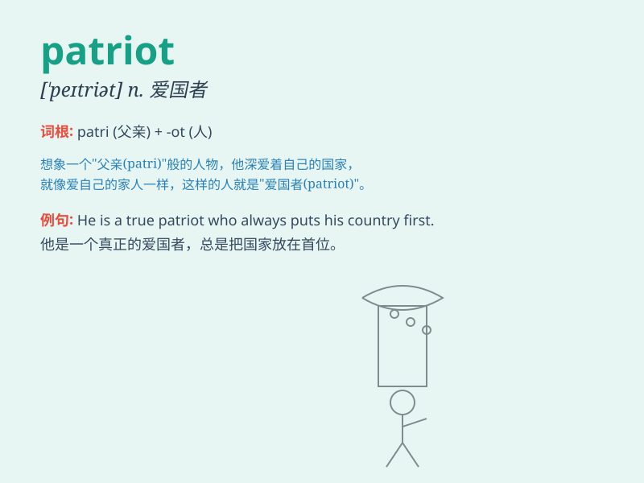

## patriot

**英音:** _[\'pætrɪət; \'peɪt-]_ **美音:** _[\'petrɪət]_

**译义:** *n.爱国者*

### 短语

+ **patriot missile:** _爱国者导弹_

+ **true patriot:** _真正的爱国者_

+ **patriot act:** _爱国者法案_

+ **loyal patriot:** _忠诚的爱国者_

+ **ardent patriot:** _热情的爱国者_

### 例句

#### 例句1

> **He is a true patriot who always stands up for his country.**

**中文翻译:** 他是一位真正的爱国者，永远捍卫自己的国家。

**单词释义:** 爱国者

#### 例句2

> **The patriot sacrificed his life for the freedom of the
nation.**

**中文翻译:** 这位爱国者为了民族的自由而牺牲了自己的生命。

**单词释义:** 爱国者

#### 例句3

> **Patriots are highly respected in this society.**

**中文翻译:** 爱国者在这个社会上受到高度尊重。

**单词释义:** 爱国者

### 背诵小故事

> A long time ago, in a small village, there was a man named Tom. When
the village was in danger, Tom bravely fought to protect it. Everyone
called him a patriot. Because he loved his homeland and was willing to
do anything for it.

**很久以前，在一个小村庄里，有个叫汤姆的人。当村庄面临危险时，汤姆勇敢地战斗来保护它。大家都称他为爱国者。因为他热爱自己的家园，并愿意为其做任何事情。**

### 图义

