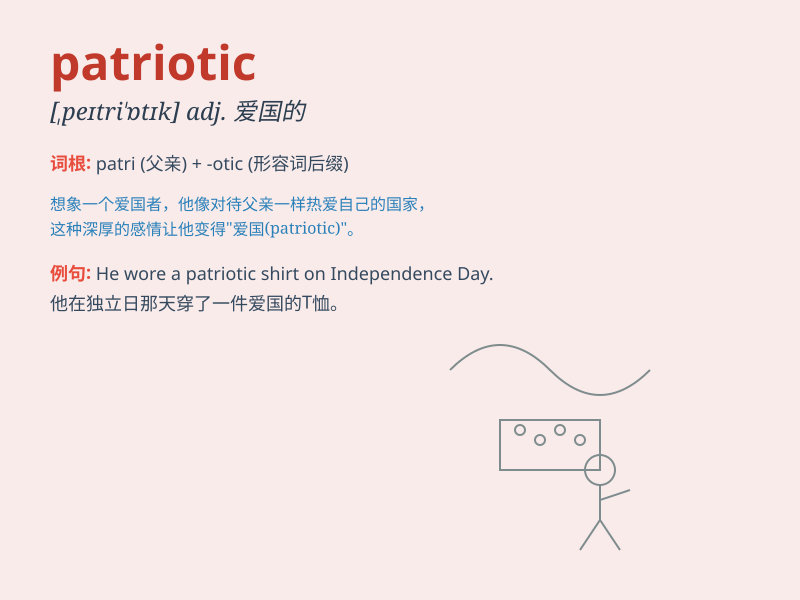

## patriotic

**英音:** _[ˌpætrɪˈɒtɪk]_ **美音:** _[ˌpetrɪˈɑtɪk]_

**译义:** *adj.爱国的,有爱国心的*

### 短语

+ **patriotic feeling:** _爱国情感_

+ **patriotic song:** _爱国歌曲_

+ **patriotic duty:** _爱国义务_

+ **patriotic citizen:** _爱国公民_

+ **patriotic movement:** _爱国运动_

### 例句

#### 例句1

> **He is a very patriotic person and always ready to defend his
country.**

**中文翻译:** 他是一个非常爱国的人，随时准备保卫自己的国家。

**单词释义:** 爱国的

#### 例句2

> **The patriotic song filled the stadium and aroused the audience\'s
enthusiasm.**

**中文翻译:** 爱国歌曲充满了体育场，激发了观众的热情。

**单词释义:** 爱国的

#### 例句3

> **She showed her patriotic spirit by participating in volunteer
activities for the community.**

**中文翻译:** 她通过参加社区志愿者活动展现了她的爱国精神。

**单词释义:** 爱国的

### 背诵小故事

> A young man named Tom was always passionate about his country. He
actively participated in community events and defended its honor. His
love and loyalty made him a truly patriotic person.

**一个叫汤姆的年轻人总是对他的国家充满热情。他积极参加社区活动并捍卫国家的荣誉。他的爱和忠诚使他成为一个真正爱国的人。**

### 图义

