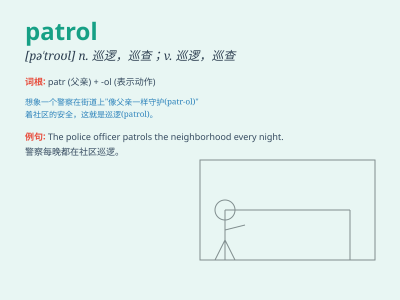

## patrol

**英音:** _[pə\'trəʊl]_ **美音:** _[pə\'trol]_

**译义:** *v.出巡,巡逻n.巡逻*

### 短语

+ **patrol car:** _巡逻车_

+ **patrol boat:** _巡逻艇_

+ **patrol area:** _巡逻区域_

+ **patrol duty:** _巡逻任务_

+ **night patrol:** _夜间巡逻_

### 例句

#### 例句1

> **The soldiers were on patrol in the mountains.**

**中文翻译:** 士兵们正在山里巡逻。

**单词释义:** 巡逻

#### 例句2

> **Police patrol the streets at night to keep the city safe.**

**中文翻译:** 警察在夜间在街道上巡逻，以确保城市安全。

**单词释义:** 巡逻

#### 例句3

> **The security guards patrol the factory every hour.**

**中文翻译:** 保安每小时在工厂巡逻一次。

**单词释义:** 巡逻

### 背诵小故事

> A group of brave soldiers was on patrol in the forest. They walked
carefully, looking for any signs of danger. Their mission was to keep
the area safe and protect everyone. \'Patrol\' means to go around an
area to watch and guard it.

**一群勇敢的士兵在森林里巡逻。他们小心翼翼地走着，寻找任何危险的迹象。他们的任务是确保这个区域的安全并保护所有人。'patrol'意思是在一个区域四处走动以监视和守卫。**

### 图义

