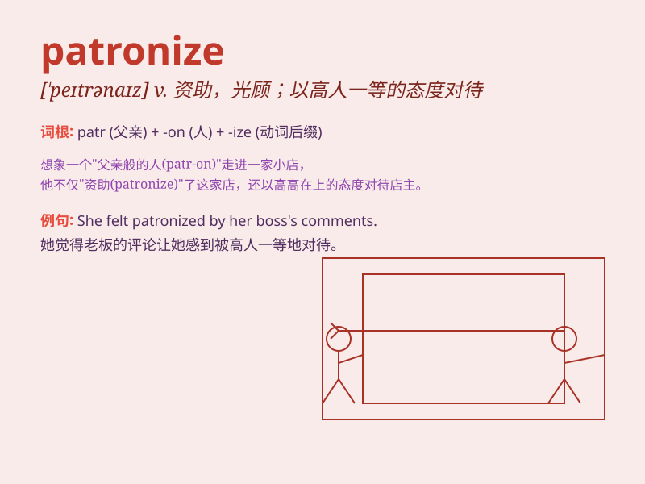

## patronize

**英音:** _[ˈpætrəˌnaɪz]_ **美音:**
_[ˈpeɪtrəˌnaɪz;ˈpætrənˌaɪz]_

**译义:** *v.资助*

### 短语

+ **patronize a store:** _光顾一家商店_

+ **patronize an artist:** _赞助一位艺术家_

+ **patronize a restaurant:** _经常去一家餐馆_

+ **patronize a charity:** _向一家慈善机构捐款_

+ **patronize a local business:** _支持本地企业_

### 例句

#### 例句1

> **Don\'t patronize me. I know what I\'m doing.**

**中文翻译:** 别光顾我。我知道我在做什么。

**单词释义:** 以高人一等的态度对待

#### 例句2

> **The store is patronized by many local people.**

**中文翻译:** 这家店有很多当地人光顾。

**单词释义:** 光顾；惠顾

#### 例句3

> **He patronizes several charities.**

**中文翻译:** 他赞助了几家慈善机构。

**单词释义:** 赞助；资助

### 背诵小故事

> A rich man always went to a small shop. He acted superior and talked
down to the shop owner. We say the rich man was patronizing the shop. It
means treating someone in a way that shows you think you are better than
them.

**一位富人总是去一家小店。他表现得高高在上，对店主说话时盛气凌人。我们说这位富人在以高人一等的态度对待这家店。patronize
意思是以高人一等的态度对待某人。**

### 图义

