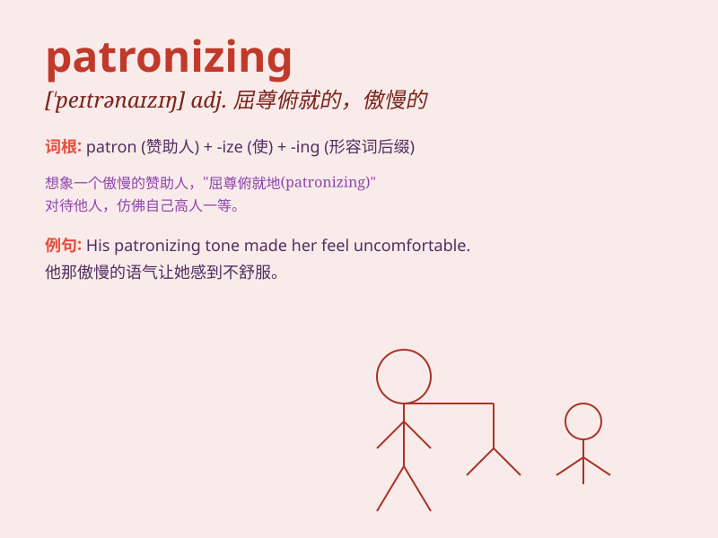

## patronizing

**英音:** _[\'pætrənaɪzɪŋ]_ **美音:** _[\'petrənaɪzɪŋ]_

**译义:** *adj.俨然以恩人态度的,要人领情的*

### 短语

+ **patronizing attitude:** _居高临下的态度_

+ **patronizing tone:** _屈尊俯就的语气_

+ **patronizing smile:** _自以为是的微笑_

+ **patronizing behavior:** _自以为高人一等的行为_

+ **patronizing comment:** _摆出恩赐态度的评论_

### 例句

#### 例句1

> **His tone was patronizing, as if he was talking down to me.**

**中文翻译:** 他的语气很居高临下，好像在居高临下地对我说话。

**单词释义:** 高人一等的；屈尊俯就的

#### 例句2

> **She gave me a patronizing smile and said I would understand when
I was older.**

**中文翻译:** 她给了我一个居高临下的微笑，说等我长大了就会明白了。

**单词释义:** 屈尊俯就的

#### 例句3

> **The manager\'s patronizing attitude towards the staff was not
appreciated.**

**中文翻译:** 经理对员工的居高临下的态度并没有得到赞赏。

**单词释义:** 屈尊俯就的

### 背诵小故事

> A customer entered a store. The clerk had a patronizing attitude,
treating the customer as if they knew nothing. The customer was angry
and left. Remember, \'patronizing\' means acting superior and
condescending.

**一位顾客走进一家商店。店员有一种居高临下的态度，对待顾客就好像他们什么都不懂。顾客很生气然后离开了。记住，\'patronizing\'意思是表现出高人一等和屈尊俯就的样子。**

### 图义

