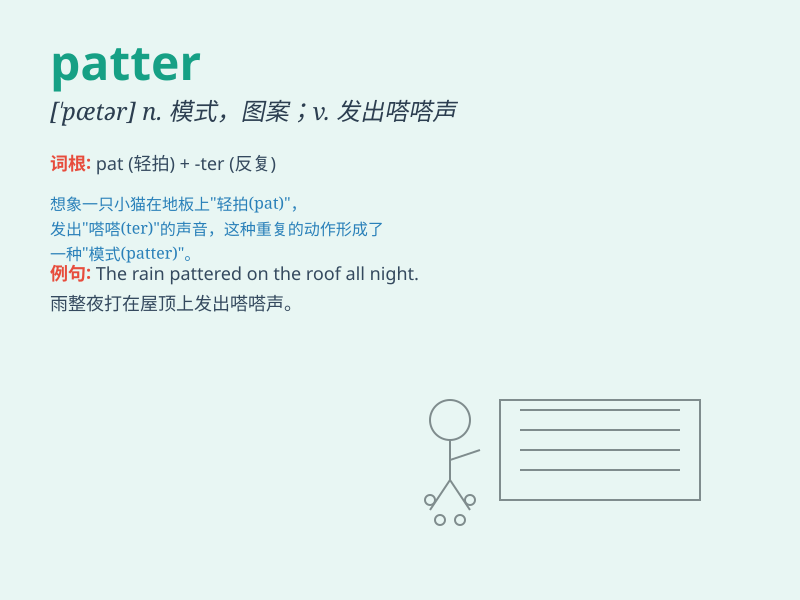

## patter

**英音:** _[\'pætə]_ **美音:** _[\'pætɚ]_

**译义:**
*n.急速拍打声,轻快脚步声,行话,(魔术师或小丑的)喋喋快语,饶舌vi.急速地说,滴答地响,发出急速轻拍声,念经,念顺口溜,祷告vt.使发嗒嗒声,喋喋不休地说*

### 短语

+ **patter along:** _轻快地行走_

+ **patter out:** _急促地说出_

+ **rain patter:** _雨点啪嗒啪嗒地落下_

+ **patter of feet:** _脚步声_

+ **patter of raindrops:** _雨滴的滴答声_

### 例句

#### 例句1

> **The rain pattered against the window.**

**中文翻译:** 雨点敲打着窗户。

**单词释义:** 发出轻快的拍打声

#### 例句2

> **Her feet pattered along the corridor.**

**中文翻译:** 她的脚在走廊上发出啪嗒啪嗒的声音。

**单词释义:** 发出轻快的脚步声

#### 例句3

> **The machine was pattering continuously.**

**中文翻译:** 机器不停地运转。

**单词释义:** 发出连续的轻响

### 背诵小故事

>
一只小猫在雨中的屋顶上，它的爪子发出\'patter\'的声音，就像快速的轻拍。雨水也\'patter\'地打在窗户上。小猫好奇地看着，这声音让它感到既兴奋又有点害怕。

**一只小猫在雨中，爪子和雨水发出的轻拍声，辅助记忆单词\'patter\'（发出急速轻拍声）**

### 图义

