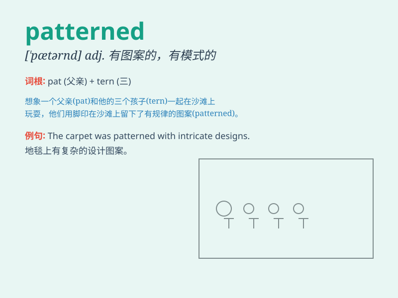

## patterned

**英音:** _[ˈpætənd]_ **美音:** _[ˈpætərnd]_

**译义:** *adj.有图案的；有花纹的；有格子的；有模式的*

### 短语

+ **patterned fabric:** _有图案的织物_

+ **patterned wallpaper:** _有图案的壁纸_

+ **patterned tile:** _有图案的瓷砖_

+ **patterned carpet:** _有图案的地毯_

+ **patterned dress:** _有图案的连衣裙_

### 例句

#### 例句1

> **The wallpaper was patterned with delicate flowers.**

**中文翻译:** 这壁纸印有精美的花朵图案。

**单词释义:** 有图案的；被组成图案的

#### 例句2

> **She wore a patterned dress to the party.**

**中文翻译:** 她穿着一条有图案的连衣裙去参加聚会。

**单词释义:** 有图案的

#### 例句3

> **The carpet is patterned in a traditional style.**

**中文翻译:** 这块地毯是传统风格的图案。

**单词释义:** 有图案的；形成图案的

### 背诵小故事

> Once upon a time, there was a beautiful dress patterned with flowers.
Everyone loved it because the pattern was so unique and charming. It
made the dress stand out.

**从前，有一件漂亮的连衣裙，上面印着花朵的图案。每个人都喜欢它，因为这个图案非常独特和迷人。它让这件连衣裙脱颖而出。**

### 图义

