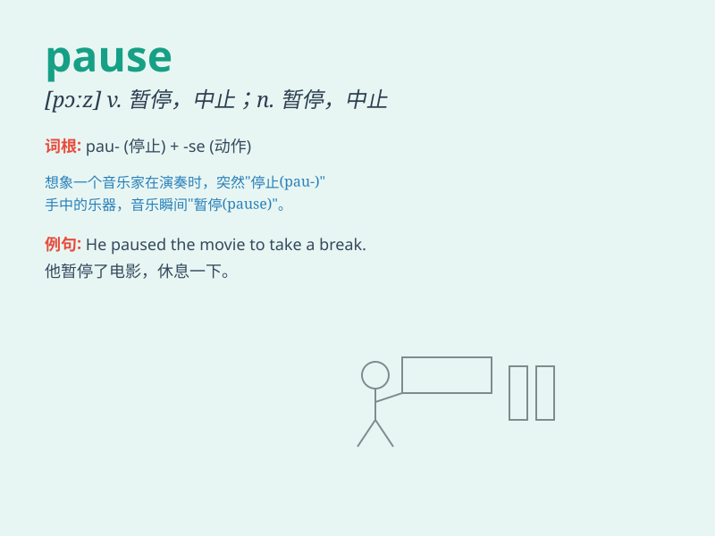

## pause

**英音:** _[pɔːz]_ **美音:** _[pɔz]_

**译义:** *n.中止,暂停,休止符vi.暂停,中止,停顿,踌躇n.暂停*

### 短语

+ **come to a pause:** _停止；停顿_

+ **give a pause:** _停顿一下_

+ **pause for breath:** _喘口气；歇口气_

+ **pause briefly:** _短暂停顿_

+ **put a pause on:** _使暂停；使中止_

### 例句

#### 例句1

> **He paused for a moment before answering the question.**

**中文翻译:** 他停顿了一会儿才回答问题。

**单词释义:** 停顿；暂停

#### 例句2

> **The music paused and then resumed a few seconds later.**

**中文翻译:** 音乐暂停，几秒钟后又恢复。

**单词释义:** 暂停；中止

#### 例句3

> **She paused at the top of the stairs to catch her breath.**

**中文翻译:** 她在楼梯顶上停下来喘口气。

**单词释义:** 停下；停顿

### 背诵小故事

> A runner was in the middle of a race. Suddenly, he felt very tired
and needed to catch his breath. So, he made a pause to rest for a moment
and then continued running.

**一位跑步者正在赛跑途中。突然，他感到非常累，需要喘口气。于是，他暂停了一下休息片刻，然后继续跑。**

### 图义

