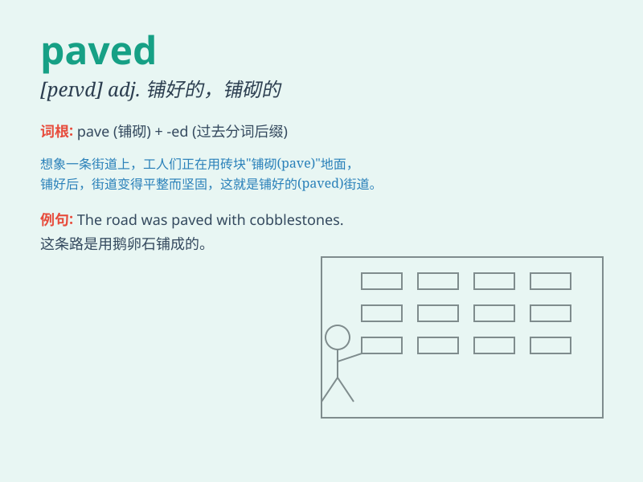

## paved

**英音:** _[peɪvd]_ **美音:** _[peɪvd]_

**译义:** *adj.（道路等）铺好的，铺砌的；v.
铺砌；为...铺平道路（pave 的过去分词和过去式）*

### 短语

+ **paved road:** _铺砌的道路_

+ **paved area:** _铺砌区域_

+ **paved courtyard:** _铺砌的庭院_

+ **paved path:** _铺砌的小路_

+ **paved square:** _铺砌的广场_

### 例句

#### 例句1

> **The street was paved with bricks.**

**中文翻译:** 这条街道用砖块铺成。

**单词释义:** 铺砌；铺设

#### 例句2

> **The path paved with stones leads to the garden.**

**中文翻译:** 用石头铺成的小路通向花园。

**单词释义:** 铺砌；铺设

#### 例句3

> **The newly paved road makes driving much smoother.**

**中文翻译:** 新铺的道路使驾驶更加顺畅。

**单词释义:** 铺砌好的；铺设好的

### 背诵小故事

> A long time ago, in a small town, there was a muddy road. But one
day, a kind man decided to change it. He worked hard and finally the
road was paved with nice stones. Now people could walk easily.

**很久以前，在一个小镇上，有一条泥泞的路。但有一天，一个善良的人决定改变它。他努力工作，最后这条路用漂亮的石头铺好了。现在人们可以轻松行走了。**

### 图义

